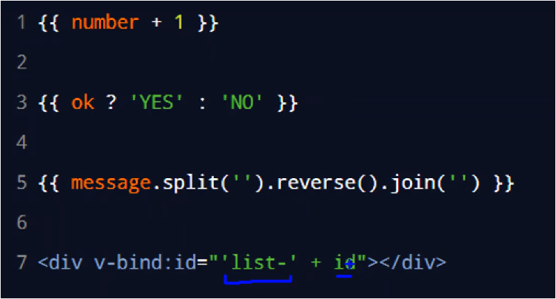
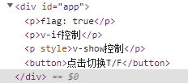
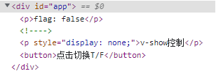

# 内容渲染指令
## 指令
1. `v-text`指令：
	+ ==使用==：使用v-text="dataName"在需要放置内容的地方,该位置即会被渲染为dataName指向的数据	
	+ ==缺点==：会==覆盖元素原有内容==！！！
2. `插值表达式：{{}}`
	+ ==使用==：使用{{dataName}}在需要放置内容的地方，该位置即会被渲染为dataName所指向的值
	+ ==优点==：只是数据的**占位符**，不会覆盖原有内容
3. `v-html`指令:
	+ ==作用==：可以将带有标签的字符串渲染成真正的html元素
## 代码
```html
<body>
    <div id="app">
        <!-- v-text表达式 -->
        <p v-text="username"></p>
        <div v-text="gender">性别</div>
        <hr>

        <!-- 插值表达式 -->
        <p>姓名：{{ username }}</p>
        <p>性别：{{ gender }}</p>
        <hr>
  
        <!-- v-html表达式 -->
        <p v-text="info"></p>
        <p>{{info}}</p>
        <p v-html="info"></p>
    </div>
</body>

<script type="text/javascript">
    const vm = new Vue({
        el:'#app',
        data:{
            username:'张三',
            gender:'男',
            info:'<h4 style="color:red; font-weight:bold;">欢迎学习Vue.js</h4>'
        }
    })
</script>
```
# 属性绑定指令
>注意：插值表达式`{{}}`只能使用在元素的**内容节点中**，==不能用在元素的属性节点中==
1. `v-bind`指令：
	+ ==作用==：v-bind指令可以将内容渲染到元素的属性节点中，可以单项绑定属性的内容
	+ ==使用==：**```<input type="text" v-bind:placeholder="tips">```**
	+ ==简化形式==：可以直接在属性前加“:”表示v-bind指令
2. 插值语法与v-bind指令的js表达式：
	


	+ ==注意==：在使用v-bind属性绑定时，如果绑定的内容需要拼接，则**字符串必须使用单引号包裹**，否则会将其当作data中的对象处理
	```html
	<div :title="'box' + index">Test</div>
	```
# 事件绑定指令
## 指令
1. v-on指令：
	+ ==作用==：v-on指令是**事件监听器**指令，可以将对某元素的**事件**转换为实际的**方法**
	+ ==用法==：
	``` html
	<input type="button" value="事件绑定" v-on:事件名="方法名">
	```
	+ 其中：
		+ ==事件名==：
			+ ==click==:点击事件
			+ ==monseenter==：鼠标移入事件
			+ ==dbclick==：鼠标双击事件
			+ ==keyup==:键盘抬起事件（可在后面加“.键名”绑定具体到那个键）
			+ ==keydown==:键盘按下事件（可在后面加“.键名”绑定具体到那个键）
			```text
			Vue 中常用的键盘按键别名：
            回车 -> enter
            删除 -> delete (删除和退格键都会触发)
            退出 -> esc
            空格 -> space
            换行 -> tab （较特殊，配合@keydown才能正常使用）
            上 -> up
            下 -> down
            左 -> left
            右 -> right
			```
		+ ==方法名==：对应的是对该元素进行了事件的操作后，需要执行的方法
			+ ==方法书写位置==：方法书写于Vue()的实体类中的methods对象中
		+ 参数：可以向方法函数中传递参数
			```html
			methods:{
				//方法名可以直接简写为addCount)
				addCount:function(num){
					console.log('addCount()')
				}
			}
			```
	+ ==简化形式==：可以使用“@”作为v-on的简化形式
## 事件方法传参
1. ==参数的传入==：
	+ ==方法==：事件方法传参可以通过在绑定事件时传入
		```html
		<input type="button" value="事件绑定" v-on:事件名="方法名(参数1,参数2,$event)">
		```
	+ ==注意点==：传参时可以加入多个参数，以“,”分隔；没有参数时**默认传入event参数**，有其他参数时要使用“==$event==”才能将传入该参数对象；
2. ==参数的接收==：
	+ ==方法==：在事件对应的方法中按传入顺序接收参数
		```html
		methods:{
			方法名(参数1,参数2,event){
				方法体
			}
		}
		```
## 事件修饰符
1. “==.prevent==”:在事件后添加“.prevent”可以阻止默认事件的发生
	- js中使用event.preventDefault()阻止默认事件
2. “==.stop==”：在事件后添加“.stop”可以阻止冒泡事件的发生
	+ js中使用event.stopPropagation())阻止默认事件
3. “==.once==”：在事件后添加“.once”可以使事件只触发一次
4. “==.capture==”：在事件后添加“.capture”可以开启事件的捕获模式
5. “==.self==”：在事件后添加“.self”可以使被标记元素在事件方法的event.target指向自己时才会触发自己的方法（一般适用于嵌套的两个元素同触发方式且同事件方法，此时点击内部的元素会将内部的方法触发两次（内部外部事件都被触发（冒泡事件），但执行方法是内部元素的方法对象））
# 数据双向绑定
> 使用==v-bind:==可以将==数据与元素单向绑定==，元素只能被数据影响

+ ==v-model:==
	+ 使用==v-model:==可以将数据与元素双向绑定，元素更新时会影响到数据，数据更新时会影响到元素
	+ 由于是元素更新时会影响到数据，所以元素必须是可更新的，所以，==v-model:仅可使用于表单元素==（input/textarea/select等）
	+ 使用：
	```html
	<input type="text" v-model:value="username">
	<!-- 简写形式 -->
	<input type="text" v-model="username">
	```
## v-model专用修饰符
+ 修饰符：
	+ ==.number==:自动将用户的输入值转换为数值类型
	+ ==.trim==:自动过滤用户输入的首位空白字符
	+ ==.lazy==:在“change”时而非“input”时更新
# 条件渲染指令
## 命令
+ ==v-if==:根据条件每次都动态创建或移除元素，以此来实现元素的显示和隐藏
	+ 初始状态为`false`,某些元素不需要被展示，后期也基本不需要被展示，使用v-if可以更省内存（性能好，根本不加载该DOM节点）
	+ ==v-else-if==与==v-else==可以与v-if配合使用，但没有v-if其并不会起作用（v-if是v-else-if和v-else的必要条件）
+ ==v-show==:根据条件动态为元素添加或移除`display:none`样式，以此来实现元素的显示或隐藏
	+ 如果要==频繁切换==元素的显示状态，推荐使用v-show
## 代码
```html
<body>
    <div id="app">
        <p >flag: {{ flag }}</p>
        
        <p v-if="flag">v-if控制</p>
        <p v-show="flag">v-show控制</p>

        <button @click="turn">点击切换T/F</button>
    </div>
</body>

<script type="text/javascript">
    Vue.config.productionTip = false;

    const vm = new Vue({
        el:'#app',
        data:{
            flag:true,
        },
        methods:{
            turn(){
                this.flag = this.flag ? false : true
            }
        }
    })
</script>
```
## 效果
+ ==flag = true==:
	


+ ==flag = false==:
	

# 列表渲染指令
## 指令
+ ==v-for==:可以将数组遍历或对象枚举，并依次渲染
	+ 使用方式：
		```html
		<tr v-for="(item,index) in 对象或数组" :key="item.id">
		</tr>
		```
		+ item：为对象或数组的一个实例
		+ index：为该实例在对象或数组中的索引，可以不写
	+ ==注意==：在使用v-for时，一定要绑定一个 `:key` 属性，:key的注意点
		1. key的值只能为==字符串或数字类型==
		2. key的值必须==具有唯一性==（key值不能重复）
		3. 建议把数据项 id 属性的值作为 key 的值（ id 属性唯一）
		4. 使用 index 的值当作key的值没有参考意义（可能重复）
## 代码
```html
<table class="table table-bordered table-hover table-striped">
	<thead>
		<th>索引</th>
		th>ID</th>
		<th>姓名</th>
		</thead>
            
	<tbody>
		<tr v-for="(item,index) in list">
			<td>{{ index }}</td>
			<td>{{ item.id }}</td>
			<td>{{ item.name }}</td>
		</tr>
	</tbody>
 </table>

------------

<script type="text/javascript">
    Vue.config.productionTip = false;

    const vm = new Vue({
        el:'#app',
        data:{
            list:[
                {id: 1,name: '张三'},
                {id: 2,name: '李四'},
                {id: 3,name: '王五'}
            ]
        }
    })
</script>
```
