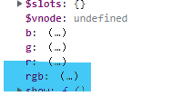

> 计算属性指的是 通过一系列运算 之后，最终得到的一个 属性值，这个动态计算出来的属性值 可以被模板结构或methods方法使用 
> 计算属性被定义在Vue实例的 computed 节点下

# 计算属性的使用
1. 计算属性被定义在 Vue实例的 **computed** 节点下
2. 计算属性在定义时 被==定义为”方法格式“==，但在==使用时为 ”对象属性“==
	  

```html
<div class="app">
	<div class="box" :style="{backgroundColor: rgb}">
		{{ rgb }}
	</div>
    <br>
    
    <button @click="show">按钮</button>
</div>

<script>
    Vue.config.productionTip = false

    const vm = new Vue({
        el: '#app',
        data: {
            r: 0,
            g: 0,
            b: 0
        },
        methods:{
            show(){
                console.log(this.rgb);
            }
        },
        //所有计算属性都要被定义在 computed 节点下
        //计算属性在定义时，要定义成“方法格式”
        computed:{
            //rgb作为一个计算属性，被定义为方法格式
            //最终，在这个方法中，返回一个生成好的 rgb(r,g,b) 的字符串
            rgb:function(){
                return `rgb(${this.r},${this.g},${this.b})`
            }
        }
    })

    console.log(vm);
</script>
```