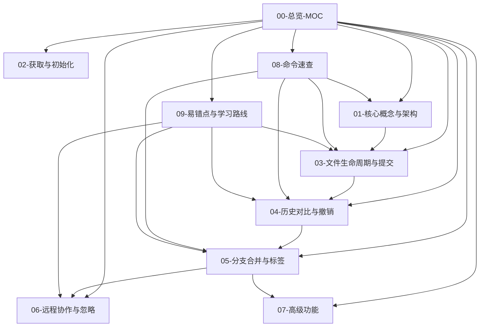

# Git 与 SVN 学习笔记 · 总览

> 本套笔记以 **Git ↔ SVN 对照** 的方式讲解两个版本控制系统的完整知识。
> 适合:会一点 Git 基础(或完全新手),需要在公司 SVN 项目中工作的开发者。

## 🗺️ 知识地图

### 基础概念
- [[01-核心概念与架构]] — 分布式 vs 集中式、Git 三大区域、SVN 两层结构、安装配置

### 日常操作
- [[02-获取与初始化]] — clone / checkout / init / import、日常核心循环
- [[03-文件生命周期与提交]] — 状态机、add / commit / delete / move、易踩坑
- [[04-历史对比与撤销]] — log / diff / blame、revert / reset / restore、回退

### 进阶操作
- [[05-分支合并与标签]] — 分支概念、trunk/branches/tags、merge、冲突解决、tag
- [[06-远程协作与忽略]] — remote / push / pull、团队协作模型、忽略规则
- [[07-高级功能]] — Git 独有(stash/rebase/cherry-pick/reflog/bisect)、SVN 独有(属性/锁/externals)

### 速查与实战
- [[08-命令速查]] — Git / SVN 完整命令速查表
- [[09-易错点与学习路线]] — 易错点总结、避坑指南、学习路线

## 🔗 推荐阅读顺序

1. [[01-核心概念与架构]] → 建立思维模型
2. [[02-获取与初始化]] → 拿到项目
3. [[03-文件生命周期与提交]] → 日常提交
4. [[04-历史对比与撤销]] → 查历史、撤销
5. [[05-分支合并与标签]] → 分支协作
6. [[06-远程协作与忽略]] → 团队协作
7. [[07-高级功能]] → 进阶
8. [[08-命令速查]] + [[09-易错点与学习路线]] → 平时翻阅

## 📌 一句话总结

> **Git 是"先在本地记账,再对账"(add → commit → push);SVN 是"当场记到总账上"(checkout → update → commit)。**

## 📎 笔记关系图

