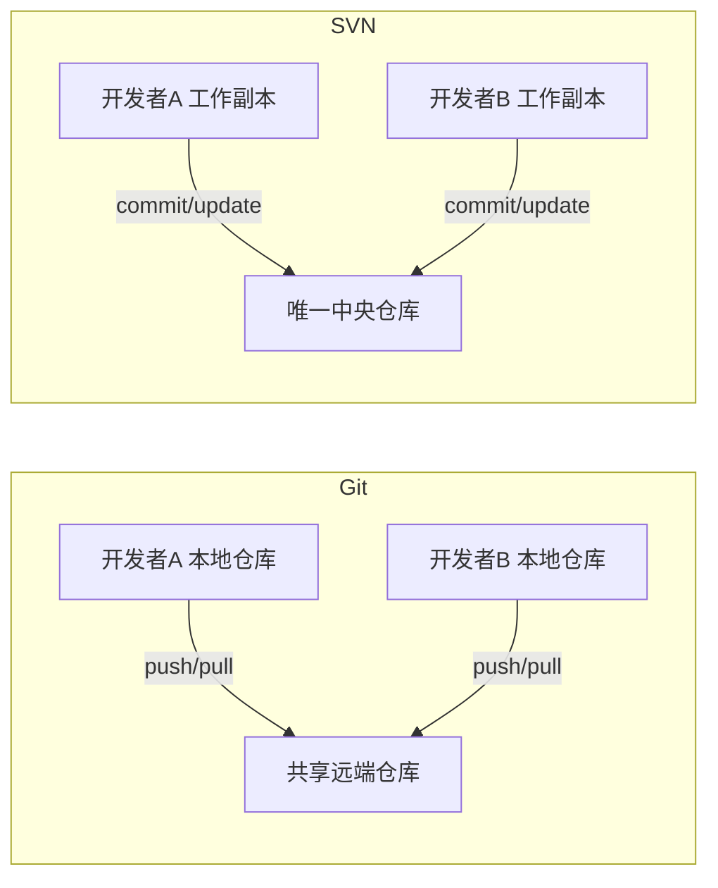

# 06 · 远程协作与忽略规则

> 相关笔记:[[02-获取与初始化]] · [[05-分支合并与标签]] · [[09-易错点与学习路线]]

## 1. Git 远程操作

### 查看与管理远程关联

```bash
git remote -v                        # 查看所有远程及 URL(fetch/push 地址)
git remote add origin <url>          # 添加远程,默认名 origin
git remote add upstream <url>        # 加第二个远程(开源常见:origin=自己,upstream=上游)
git remote set-url origin <新url>    # 修改远程地址(仓库搬家)
git remote remove origin             # 删除远程关联
git remote rename origin upstream    # 重命名远程

# 常见用法:从 upstream 拉最新,推到自己的 origin
git pull upstream main
git push origin feature
```

### 拉取与推送

```bash
git fetch origin                 # 只拉取不合并
git pull origin main             # 拉取并合并(= fetch + merge)
git pull --rebase                # 拉取后用 rebase 而非 merge,历史更干净(推荐)
git push origin main             # 推送
git push -u origin main          # 首次推送并建立关联(-u 记住对应关系)
git push --force                 # ⚠️ 强制覆盖远程(会覆盖别人的提交,慎用)
git push --force-with-lease      # 更安全:远程若有人新提交则拒绝推送
git branch -a                    # 本地 + 远程分支
```

> **SVN 无对应**:没有多远程/upstream,也没有 `--force`(历史在服务器上,无法覆盖)。同步只有 `svn update`(拉)和 `svn commit`(推)。

## 2. SVN 的"远程"概念

SVN **没有"远程仓库"**——checkout 的 URL 就是唯一仓库,没有多 remote。同步只有两个动作:
- `svn update`(服务器 → 本地)
- `svn commit`(本地 → 服务器)

## 3. 团队协作模型



## 4. 忽略文件

| | Git | SVN |
|---|---|---|
| 机制 | 项目根 `.gitignore`(提交共享) | 目录属性 `svn:ignore` |
| 设置 | 直接写文件 | `svn propset` / `svn propedit` |
| 查看 | `git status` 不再显示 | `svn status` 不再显示 |

```bash
# Git:.gitignore
bin/
obj/
*.user
.vs/

# SVN:在项目根目录设置忽略
svn propset svn:ignore "bin
obj
*.user
.vs" .
# 或交互编辑
svn propedit svn:ignore .
# 查看
svn propget svn:ignore .
```

> 从 Git 项目转到 SVN,需要把 `.gitignore` 的规则转成 `svn:ignore` 属性。
