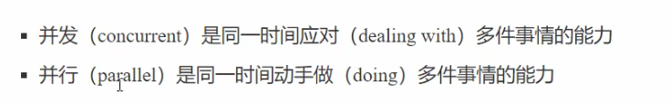

# 进程与线程
**进程：** 可以理解为程序的一个实例，windows中进程是不活动的，只是作为线程的容器
**线程：** 一个进程可以包含多个线程，一个线程就是一个指令流，将指令流中的一条条指令按一定的顺序交由CPU执行；java中，线程是最小调度单位，进程是资源分配的最小单位
# 并行与并发
**并发：**：同一时间线程轮流使用CPU的做法称为并发(concurrent)
**并行：**：多核CPU中，多个线程同时运行称作并行（并行过程中大多包含并发）

# 同步与异步
从方法调用的角度来讲，如果
+ 需要等待结果返回才能继续运行，是**同步**
+ 不需要等待结果返回会就能继续运行，是**异步**
注意：同步在多线程中还有另一层意思，就是让多个线程步调一致