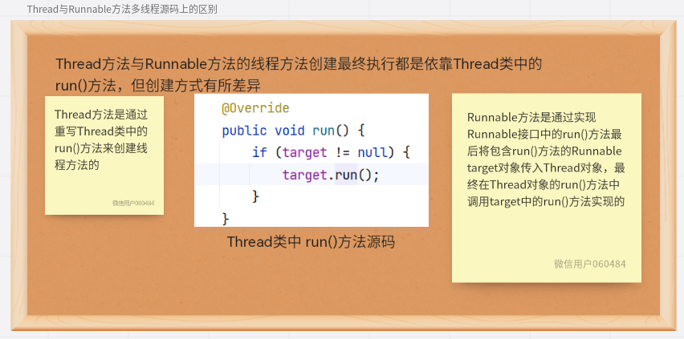
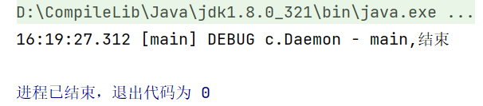
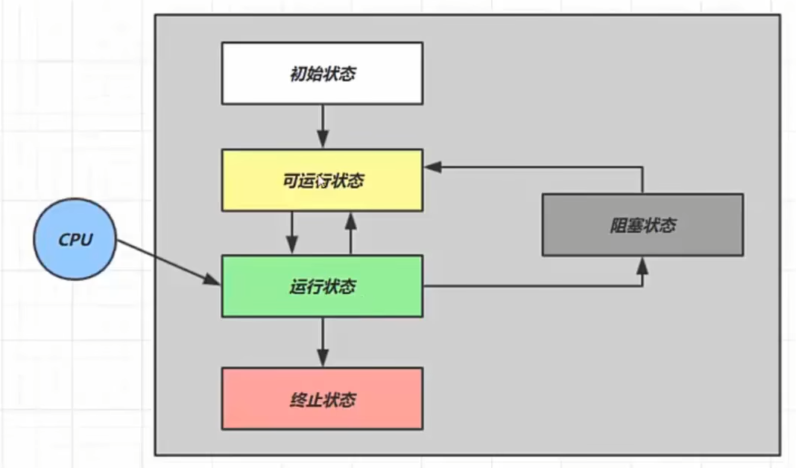

+ 创建和运行线程
+ 查看线程
+ 线程API
+ 线程状态

# 2.1.创建和运行线程
## 2.1.1.Thread方法
### 1)匿名内部类编写Thread
+ 方法：
```java
//创建线程对象
//匿名内部类写入线程内容
Thread t = new Thread(){
	public void run(){
		//线程类方法
	}
};
//启动线程
t.start();
```
+ 实例：
```java
//匿名内部类书写线程体  
//编辑线程时可以为其命名（此处使用构造函数传入线程名，话可以使用setName()方法指定线程名）
Thread t1 = new Thread("t1"){  
	// 重写run方法  
	@Override  
	public void run() {  
	log.debug("running_thread");  
	}  
};
//指定线程名
//t1.setName("t1");
//启动线程
t.start();
```
### 2)线程类重写Thread类编写线程
[线程类重写Thread类编写线程](./多线程学习#线程的创建##Thread类创建)

## 2.1.2.Runnable方法
+ 方法：
```java
//创建线程对象
//匿名内部类写入线程内容
Runnable runnable = new Runnable(){
    //线程类方法
};
//创建线程对象
Thread t2 = new Thread(runnable, "t2");
  //启动线程      
 t2.start();
```
+ 实例：
```java
    public static void main(String[] args) {
        Runnable runnable = new Runnable(){
            @Override
            public void run() {
                log.debug("running_runnable");
            }
        };

        Thread t2 = new Thread(runnable, "t2");

        t2.start();
    }
```
+ ==注==：当接口中只有一个抽象方法时，可以使用Lambda表达式简写抽象方法的实现
```java
    public static void main(String[] args) {
        Runnable runnable = () ->{
            log.debug("running_runnable");
        };

        Thread t2 = new Thread(runnable, "t2");

        t2.start();
    }
```

## 2.1.3.Thread与Runnable的关系

**小结：**
+ Thread方法是将 线程 和 任务 合并在了一起，Runnable方法则是将线程与任务分开
+ Runnable发给发更容易与线程池等该机API配合(推荐使用Runnable方法)
+ 使用Runnable方法让任务类脱离了Thread继承体系，更加灵活

## 2.1.4.FutureTask配合Thread
+ 方法：
```java
//创建线程对象
FutureTask<Integer> task = new FutureTask<Integer>(new Callable<Integer>() {
    @Override
    public Integer call() throws Exception {
         log.debug("FutureTask running...");
        Thread.sleep(1000);
        return 100;
    }
});

//开启线程
Thread t3 = new Thread(task, "t3");
t3.start();

//主线程阻塞，等待task线程执行完毕得到返回值后才能继续运行
log.debug("{}",task.get());
```
+ 解释：
> Thread方法和Runnable方法实现的run()方法都是“void”，无法向外传递参数，使用FutureTask方法则可以向外传递线程返回值，因此可以通过FutureTask方法实现线程之间的通信。

# 2.2.查看进程线程的方法
## Windows下
+ 任务管理器查看进程和线程数，也可以用来杀死线程
+ ```tasklist``` 查看进程
+ ```taskkill``` 杀死进程

## Linux下
+ ```ps -fe``` 查看所有进程
+ ```ps -fT -p <PID>``` 查看某进程(PID)的所有线程
+ ```kill``` 杀死进程
+ ```top``` 按“H”切换显示是否显示线程
+ ```top -H -p <PID> ```查看某个进程(PID)的所有线程

## 所有Java程序

+ ```jps``` 命令查看所有 Java 进程
+ ```jstack <PID>``` 查看某个 Java 进程（PID）的所有线程状态
+ ```jconsole``` 来查看某个 Java 进程中线程的运行情况（图形界面）

### jconsole 远程监控配置
+ 需要以如下方式运行你的 java 类

```
java -Djava.rmi.server.hostname=`ip地址` -Dcom.sun.management.jmxremote -
Dcom.sun.management.jmxremote.port=`连接端口` -Dcom.sun.management.jmxremote.ssl=是否安全连接 -
Dcom.sun.management.jmxremote.authenticate=是否认证 java类
```

+ 修改 /etc/hosts 文件将 127.0.0.1 映射至主机名

如果要认证访问，还需要做如下步骤

+ 复制 jmxremote.password 文件
+ 修改 jmxremote.password 和 jmxremote.access 文件的权限为 600 即文件所有者可读写
+ 连接时填入 controlRole（用户名），R&D（密码）

# 2.3.线程运行原理

# 2.4.线程常见方法
[线程常见方法表格](./并发编程.pdf#page=16&selection=80,0,82,4)
## [2.4.1.start与run](./并发编程.pdf#page=17&selection=8,0,8,7)
==如下方法适用 start()与run()方法：==
```java
public static void main(String[] args) {  
    Thread t1 = new Thread("t1"){  
        @Override  
        public void run() {  
            log.debug("running...");  
        }  
    };  
    t1.run();  
    t1.start();  
}
```
==其结果为：==


==结果表明：==
+ start()方法调用会直接开启一个线程并在新线程中执行run()方法
+ run()方法调用则真的只是方法的调用，会执行run()方法，不会开启新线程

## 2.4.1.[sleep与yield](./并发编程.pdf#page=18&selection=8,0,9,1)
**sleep：**
1. 调用 sleep 会让当前线程从 Running 进入 Timed Waiting 状态（阻塞）
2. 其它线程可以使用 interrupt 方法打断正在睡眠的线程，这时 sleep 方法会抛出 InterruptedException
3. 睡眠结束后的线程未必会立刻得到执行
4. 建议用 TimeUnit 的 sleep 代替 Thread 的 sleep 来获得更好的可读性
**yield**
1. 调用 yield 会让当前线程从 Running 进入 Runnable 就绪状态，然后调度执行其它线程
2. 具体的实现依赖于操作系统的任务调度器

**线程优先级**
+ 线程优先级会提示（hint）调度器优先调度该线程，但它仅仅是一个提示，调度器可以忽略它
+ 如果 cpu 比较忙，那么优先级高的线程会获得更多的时间片，但 cpu 闲时，优先级几乎没作用

## 2.4.3.[join](Java/JUC/并发编程.pdf#page=20&selection=6,3,8,4)
**join**:
+ 等待被join()方法标定的线程结束，程序才能继续向下运行（变异步为同步）
+ join()方法中可以填入参数（参数为最大等待毫秒数），当超过该毫秒数，线程将不在等待

## 2.4.4.[interrupt](Java/JUC/并发编程.pdf#page=24&selection=0,2,8,4)
**interrupt：**
+ 使用interrupt()方法可以将线程的==“打断标记”==置为“true”（线程是否被打断由线程自己决定）
+ sleep、wait、join方法被打断时会出现==“打断异常”==，而==“打断标记”==在==“打断异常”==后状态会被清空（即使被打断了，==“打断标记”==也是“false”）
+ ==isIntererupted()==和==interrupted()==都可以判断线程是否被打断，但**interrupted()会清除“打断标记”**

## 2.4.5.守护线程
> 默认情况下，Java 进程需要等待所有线程都运行结束，才会结束。有一种特殊的线程叫做守护线程，只要其它非守护线程运行结束了，即使守护线程的代码没有执行完，也会强制结束

==示例代码：==
```java
Thread t1 = new Thread(() -> {  
    while (true) {  
        if (Thread.currentThread().isInterrupted()) break;  
    }  
    log.debug("t1,结束");  
},"t1");  
t1.setDaemon(true);  
t1.start();  
  
  
Thread.sleep(1000);  
log.debug("main,结束");
```
==结果：==


# 2.5.线程的状态
+ ==[从操作系统层面来看，有5种状态：](Java/JUC/并发编程.pdf#page=28&selection=53,0,53,4)==



