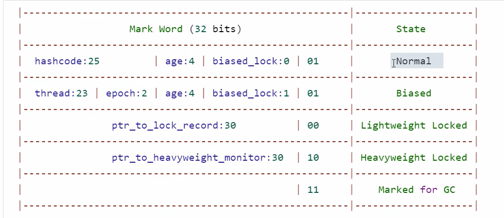
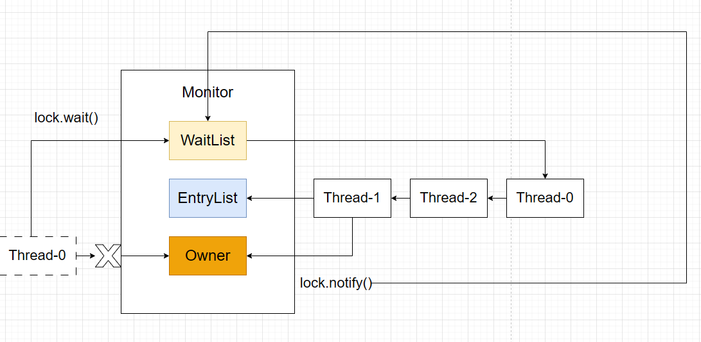
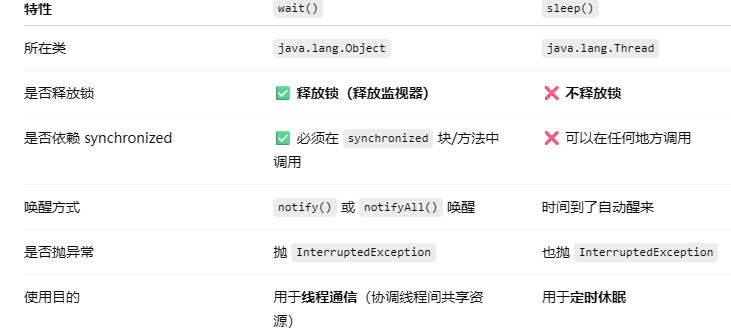

# 1.锁膨胀
>Java锁是随着竞争激烈程度**逐渐升级**的，目的就是要在不必要使用重量级操作系统自研的情况先，也能保持线程安全和良好的性能。这样的情况就叫做**锁的优化升级机制**，也叫**锁膨胀机制**
  无锁 --> 偏向锁 --> 轻量锁 --> 重量锁

# 2.CAS操作
#TODO

# 3.自旋优化
> **自旋（spin）**，就是**线程在获取锁失败时不立即阻塞，而是在原地循环等待一段时间**，尝试重新获取锁。这个过程带来的效果： 避免了阻塞线程（挂起）带来的**上下文切换开销**；如果锁在**很短时间内就会被释放**，那“自旋”可以更快拿到锁。

# 4.对象头中的MarkWord结构

# wait()/notifty()相关概念
> Java 中的 `wait()` 和 `notify()` 是实现**线程间通信**的关键方法，它们都定义在 `java.lang.Object` 类中，作用于对象的 **监视器锁（Monitor）**(也就是说**只有重量锁可以用**这个)

| 方法            | 说明                           |
| ------------- | ---------------------------- |
| `wait()`      | 当前线程**释放锁**，进入等待状态，直到被其它线程唤醒 |
| `notify()`    | 唤醒一个等待该对象锁的线程（但并不立刻释放锁）      |
| `notifyAll()` | 唤醒所有等待该对象锁的线程                |

+ **流程**：在线程获取锁对象后可以使用`lock.wait（）`进入等待状态，该线程会解锁并被放入`WaitSet`中等待唤醒，而阻塞队列`EntryList`中的阻塞线程会获得锁；使用`lock.notify（）/lock.notifyAll()`可以唤醒等待中的线程(JVM虚拟机中notify()方法会随机唤醒，而hotspot虚拟机则是按照队列的顺序唤醒)，被唤醒的线程会进入阻塞队列`EntryList`中，重新竞争锁对象
	

+ **wait()和sleep()区别**：
	

# park()和unpark()
> 它们是 `java.util.concurrent.locks.LockSupport` 提供的 **底层线程阻塞和唤醒工具**。 `park()`：让当前线程阻塞（暂停执行），直到被唤醒。`unpark(Thread thread)`：唤醒指定线程，让它从 `park()` 中恢复。

1. **核心特性**：
	+ **不需要加锁就**能直接运行
	+ **`park()`和`unpark()`不需要成对出现**：可以先调用`unpark()`再调用`park()`，此时线程并不会被阻塞(`ubpark()`相当于发放许可证，拥有许可证`park()`会对线程放行)