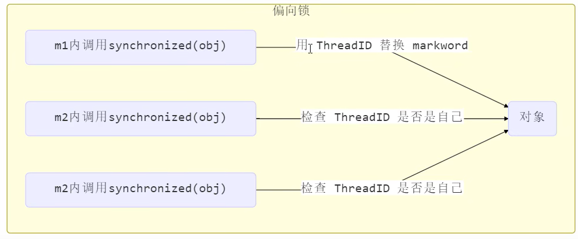
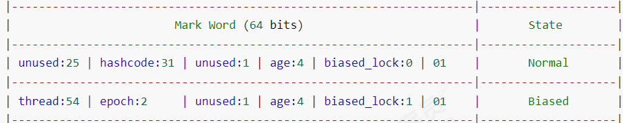

> 轻量锁在没有其他线程竞争时，每次锁重入都会进行`CAS`操作，但除开第一次的`CAS`操作，在这种非竞争的条件下锁重入时的`CAS`操作显得多余，由此引入偏向锁。偏向锁解决的问题是线程会对锁对象加锁，但只有一个线程会对锁对象加锁。
> **偏向锁在JDK6引入，在JDK15不再默认开启，在JDK17被废弃**

## 偏向锁流程
1. **偏向锁加锁**：偏向锁会使用`CAS`操作替换锁对象的markword为自己的ThreadID(***不会创建锁记录***)，当有新的加锁请求时，检查ThreadID是否是自己
	1. **ThreadID是自己**：直接进入同步块，无需再加锁，也不会再创建锁记录（Lock Record）
	2. **ThreadID不是自己**：发生了多线程竞争锁对象，进入锁膨胀
	
2. **偏向锁解锁**：**退出 synchronized 块时**，偏向锁 **不会** 清除线程 ID；解锁时 **不做任何操作**，只是程序退出临界区(因为偏向锁并没有真正“加锁”，所以也不需要“解锁”)；

## 偏向锁相关概念
### 偏向锁的状态
> 偏向锁在JDK6~JDK14是默认开启的，但开启有延迟，不会再程序开启时立即开启，使用`XX:BiasedLockingStartupDelay=0` 可以让偏向锁在程序启动时立即开启；使用`-XX:-UseBiasedLocking`可以关闭偏向锁(-表示关闭，+表示开启)

1. **对象调用hashCode()方法使偏向锁失效**
	+ 使用`hashCode()`方法后，markword中hashcode的值会挤占thread的空间，导致偏向锁失效(**此时如果对该对象加锁，则直接加轻量锁**)
	

2. **当其他线程竞争锁对象时，会发生锁升级，直接升级为轻量锁，偏向锁失效**

3. **锁对象调用`wait()/notify()`方法，该方法为重量锁拥有，使用则直接锁膨胀为重量锁，偏向锁失效*

### 批量重偏向
> 如果对象虽然被多个线程访问，但没有竞争，这时偏向了线程 T1 的对象仍有机会重新偏向 T2，重偏向会重置对象 的 Thread ID 当撤销偏向锁阈值超过 20 次后，jvm 会这样觉得，我是不是偏向错了呢，于是会在给这些对象加锁时重新偏向至 加锁线程

### 偏向批量撤销
> 当撤销偏向锁阈值超过 40 次后，jvm 会这样觉得，自己确实偏向错了，根本就不该偏向。于是整个类的所有对象 都会变为不可偏向的，新建的对象也是不可偏向的