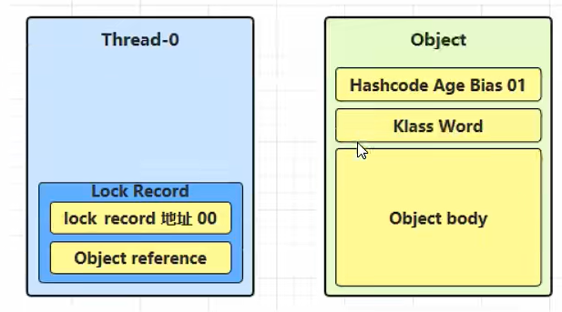
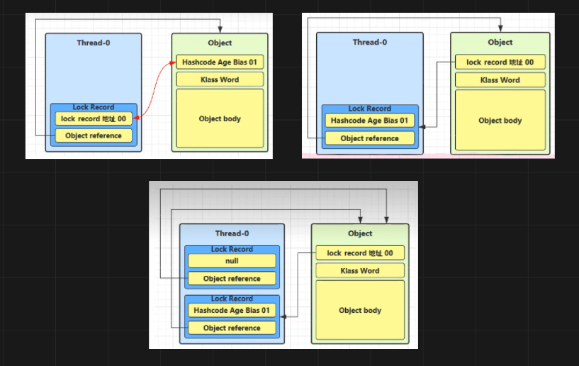

> 轻量锁是由偏向锁升级而来的，升级条件是有第二个线程竞争获取偏向锁的线程的锁对象。轻量锁解决的线程锁优化问题是：虽然有多个线程需要使用锁对象，但在线程同步周期内，没有其他的线程竞争锁对象，或虽然有其他线程竞争锁对象，但该线程经过一个等待期(自旋等待)后本线程就已经结束了锁对象的使用，此时可使用轻量锁对并发操作进行优化

## 轻量锁使用
+ 轻量锁使用为基础的==synchronized==用法
``` java
static final Object lock = new Object();  
  
new Thread(()->{
	synchronized (lock) {  
        System.out.println("thread-01");  
    } 
},"t1").start(); 
  
new Thread(()->{
	synchronized (lock) {  
        System.out.println("thread-02");  
    } 
},"t2").start(); 
```

## 轻量锁流程
1. **创建锁记录**：一个线程对一个对象进行加锁时，会先在自己的==栈帧==中创建一条锁记录(Lock Record)
	
2. **锁记录关联对象**：Object reference会指向加锁对象，同时，使用==cas==操作替换Object中的MarkWord，并将其存入锁记录
	


	+ **成功**：对比Object中的加锁状态码，为01(未加锁)，则加锁
	+ **失败**：对比Object中的加锁状态码，不为01
		+ **锁重入**：如果Object中的MarkWord是自己，则说明发生了锁重入，此时在栈帧中再加入一条锁记录，但将其所记录中的`displace-mark-word`设为null（每个 `synchronized` 块进入就要有对应的 `exit`（退出），JVM 需要这个 Lock Record 来正确匹配退出锁的次数。）
		+ **锁冲突**：如果Object中的MarkWord不是自己，则等待一个自旋，重复上述过程，再次失败则进入==锁膨胀==
3. **解锁**：开始解锁时，检查自己锁记录中是否有===null==值
	+ **有null**：有的话则说明发生了锁重入，此时删除这条记录，表示重入计数减一
	+ **无null**：使用==cas==操作还原Object中得到MarkWord
		+ **成功**：解锁成功
		+ **失败**：说明轻量锁已经膨胀为重量锁，进入重量锁解锁过程


