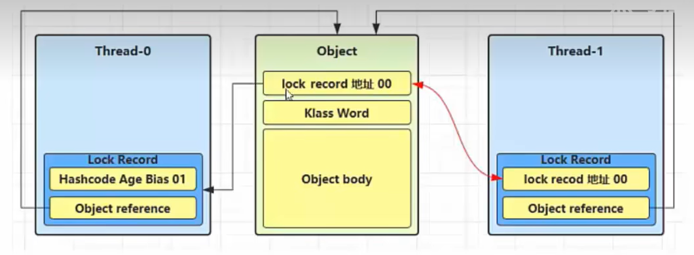
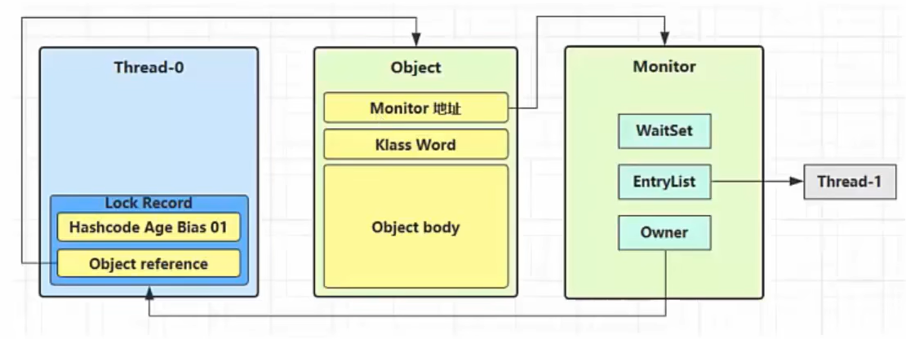

> 重量锁是由轻量锁升级而来，升级条件是当一个线程持有一个对象时第二个线程来竞争这个对象，但发现对象已被加锁，在等待一个自旋周期后仍未获得锁对象，此时轻量锁会进行锁膨胀生成重量锁。

## 重量锁使用
+ 重量锁由轻量锁升级而来，由JVM控制，非表象代码实现
``` java
static final Object lock = new Object();  
  
new Thread(()->{
	synchronized (lock) {  
        System.out.println("thread-01");  
    } 
},"t1").start(); 
  
new Thread(()->{
	synchronized (lock) {  
        System.out.println("thread-02");  
    } 
},"t2").start(); 
```

## 重量锁流程
0. **前置**：重量锁是由轻量锁升级而来，此时必定又两个或多个线程竞争锁对象
		

1. **加锁**：
	1. **创建==Monitor==对象头**：创建Monitor对象头，Monitor 中保存了当前**==持有锁的线程==**、**==等待锁的线程队列==**等；
	2. **Monitor对象头关联对象**: Monitor中的==Owner==指向原来轻量锁线程对象，竞争线程进入等待锁的线程队列
		

2. **解锁**：
	1. **轻量锁升级为重量锁解锁**：Thread-0退出同步块进行解锁时，尝试使用CAS操作将Mark word回复给锁对象头时，此时锁对象头中不再是栈帧中的锁记录地址，而是Monitor对象地址，则CAS操作失败，进入重量锁解锁流程
	2. **重量锁解锁**：根据锁对象头的Monitor对象地址找到Monitor对象，设置Owner为null，唤醒EntryList中的阻塞线程，并将Owner指向新的线程