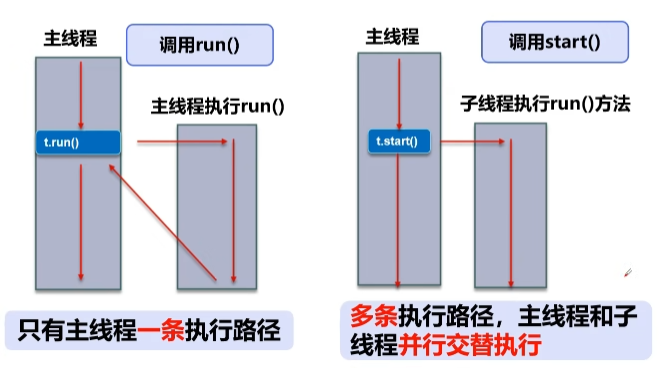
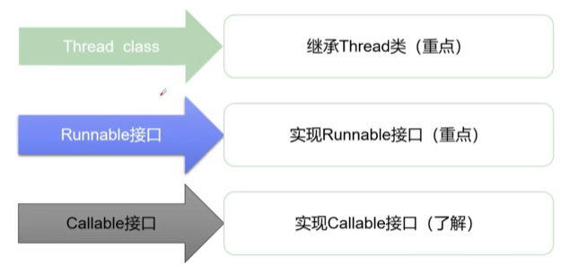
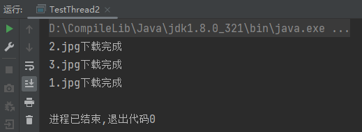
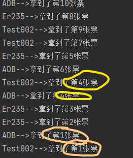
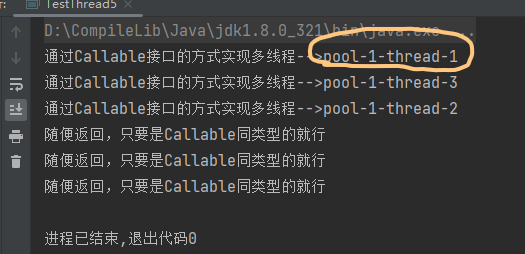
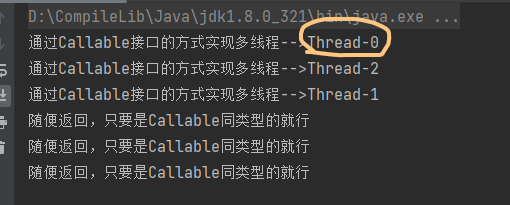
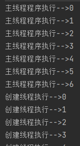

# 线程简介

+ **程序**：完成特定任务，用某种语言写成的指令集，是**一段静态的代码**(静态的对象)
+ **进程**：程序的依次执行过程，或是**正在运行的的一个程序**(动态的过程)

+ **线程**：**程序内部的一条执行路径**


||
|:--:|
|"方法调用和多线程"|

## 线程的核心概念

+ 线程是独立的**执行路径**
+ 程序执行时后台会**默认存在一些线程**，如主线程（main线程，系统的入口），gc线程 （垃圾回收线程）
+ 一个进程中如果有多个线程，线程的**运行由调度器安排调度**
+ 多个线程对同一份资源操作时，会出现**资源抢夺**，要加入**并发控制**
+ 多线程吃电脑资源
+ 每个线程在**自己的工作内存中交互**，内存控制不当会数据不一致


# 线程的创建

Thread、Runnable、Callable

|  |
| :------------------------------------------------: |
|                 线程的三种创建方式                 |

## Thread类创建

1. 继承Thread类

2. 将线程工作**重写到run()方法**内

3. 再在主(或其他)线程内使用**线程类的对象调用start()方法**开启线程

``` java
//创建线程的方法一： 继承Thread类，重写run()方法，调用start开启线程
public class TestThread1 extends Thread{
    @Override
    public void run() {
        //重写run()方法
        //super.run();

        for (int i = 0; i < 20; i++) {
            System.out.println("创建线程执行-->"+i);
        }
    }

    public static void main(String[] args) {
        //main线程，主线程

        //创建线程类对象
        TestThread1 testThread1 = new TestThread1();
        //对象调用start()方法开启线程
        testThread1.start();


        //主线程程序体
        for (int i = 0; i < 20; i++) {
            System.out.println("主线程程序执行-->"+i);
        }
    }
}
```


### Thread类创建线程示例

``` java	
import org.apache.commons.io.FileUtils;
import java.io.File;
import java.io.IOException;
import java.net.URL;

//继承Thread类
public class TestThread2 extends Thread{

    private String url;  //下载地址
    private String fileName;  //保存名称


    //构造器，初始化参数
    public TestThread2(String url,String fileName){
        this.url = url;
        this.fileName = fileName;
    }

    //重写run()方法
    @Override
    public void run() {
        //super.run();

        //引入下载器，执行下载
        WebDownloader webDownloader = new WebDownloader();
        webDownloader.downloader(url,fileName);
        System.out.println(fileName+"下载完成");
    }

    public static void main(String[] args) {

        //创建线程
        TestThread2 t1 = new TestThread2("https://alifei03.cfp.cn/creative/vcg/nowarter800/version21/VCG21gic20084438.jpg?x-oss-process=image/format,webp","1.jpg");
        TestThread2 t2 = new TestThread2("https://tenfei04.cfp.cn/creative/vcg/nowater800/new/VCG21gic20019841.jpg?x-oss-process=image/format,webp","2.jpg");
        TestThread2 t3 = new TestThread2("https://tenfei04.cfp.cn/creative/vcg/nowater800/new/VCG21gic20019841.jpg?x-oss-process=image/format,webp","3.jpg");

        //线程启动
        t1.start();
        t2.start();
        t3.start();
    }

}


//下载器
class WebDownloader{
    public void downloader(String url,String fileName){
        try {

            //引入jar包，使用工具类下载图片
            //（下载地址，保存名称）
            FileUtils.copyURLToFile(new URL(url),new File(fileName));
        } catch (IOException e) {
            e.printStackTrace();
            System.out.println("I/O异常，downloadr()方法");
        }
    }
}
```


||
|:--:|
|结果可见，并不是按照程序中线程启动顺序执行的(**具有相同优先级**)|


## Runnable接口创建

1. 定义MyRunnable类实现**Runnable**接口
2. 实现run()方法，编写程序执行体
3. **创建runnable接口实现类对象**,**创建线程对象**，将实现类对象放入new Thread(**实现类对象**)，**线程对象**调用start()方法执行线程 

``` java
//创建线程方法2：实现Runnable接口，重写run()方法，执行线程需要丢入runnable
public class TestThread3 implements Runnable{

    //重写run()方法
    @Override
    public void run() {
        //线程执行体
        for (int i = 0; i < 200; i++) {
            System.out.println("创建线程执行-->"+i);
        }
    }

    public static void main(String[] args) {

        //创建runnable接口实现类对象
        TestThread3 testThread3 = new TestThread3();

        //创建线程类对象,通过线程对象开启线程
//        Thread thread = new Thread(testThread3);
//        thread.start();
        new Thread(testThread3).start();


        //主线程程序体
        for (int i = 0; i < 200; i++) {
            System.out.println("主线程程序执行-->"+i);
        }
    }
}
```


 ### Runnable接口创建线程示例

``` java
// 订票系统演示

public class TestThread4 implements Runnable{

    //定义总票数
    private int tickNums = 10;

    //继承Runnable接口并重写run()方法


    @Override
    public void run() {

        //方法体作用，当系统中还存有票余量时，订票就能继续执行
        //考虑到方便演示，每次订票后会有一定时延

        while (true){
            if (tickNums <= 0) break;
            System.out.println(Thread.currentThread().getName() + "-->拿到了第" + tickNums-- + "张票");
            try {
                Thread.sleep(200);
            } catch (InterruptedException e) {
                throw new RuntimeException(e);
            }
        }
    }

    public static void main(String[] args) {

        //接口类实例化
        TestThread4 testThread4 = new TestThread4();

        //多线程启动
        new Thread(testThread4,"ADB").start();
        new Thread(testThread4,"Test002").start();
        new Thread(testThread4,"Er235").start();
    }

}
```

||
|:--:|
|多个线程操作同一个资源，线程不安全，容易数据紊乱 （***并发问题***）|


## Callable接口创建线程

| 方法一 | 方法二 |
| :----- | :----- |
| 实现Callable接口，并重写call方法，需要抛出异常 | 实现Callable接口，并重写call方法，需要抛出异常 |
| 创建接口类对象 | 创建接口类对象 |
| 创建执行服务(创建线程池)：ExecutorService ser = Executors.newFixedThreadPool(线程池大小); | 用FuturreTask包装器包裹接口实现类对象：FutureTask<Object> future1 = new FutureTask<Object>(t1); 可以通过future1.get()获取**线程执行返回值** |
| 线程提交线程池执行：Future<Object> r1 = ser.submit(t1); 可通过**线程池返回值r1.get()** 获取**线程执行返回值** | 用Thread开启线程：new Thread(future1).start(); |
| 关闭服务(关闭线程池):ser.shutdownNow(); | 无 |


``` java
//多线程方法三：实现Callable接口  
public class TestThread5 implements Callable<Object> {  
    @Override  
    public Object call()  {  
  
        System.out.println("通过Callable接口的方式实现多线程-->" + Thread.currentThread().getName());  
        return (Object) "随便返回，只要是Callable同类型的就行";  
    }  
  
    public static void main(String[] args) throws Exception{  
  
        //实例化接口类对象  
        TestThread5 t1 = new TestThread5();  
        TestThread5 t2 = new TestThread5();  
        TestThread5 t3 = new TestThread5();  
  
  
  
  
//        //正常的创建方式  
//        Callable t1 = new TestThread5();  
//        Callable t2 = new TestThread5();  
//        Callable t3 = new TestThread5();  
  
  
        FutureTask<Object> future1 = new FutureTask<Object>(t1);  
        FutureTask<Object> future2 = new FutureTask<Object>(t2);  
        FutureTask<Object> future3 = new FutureTask<Object>(t3);  
  
        //用Thread开启线程  
        new Thread(future1).start();  
        new Thread(future2).start();  
        new Thread(future3).start();  
  
        //可以获取返回值  
        System.out.println(future1.get());  
        System.out.println(future2.get());  
        System.out.println(future3.get());  
  
  
  
/*        //创建执行服务(实际是创建了一个拥有3个线程的线程池)  
        ExecutorService ser = Executors.newFixedThreadPool(3);  
        //提交线程池执行线程  
        Future<Object> r1 = ser.submit(t1);
        Future<Object> r2 = ser.submit(t2);
        Future<Object> r3 = ser.submit(t3);  
        //通过线程池返回的数据可以获得线程返回值  
        System.out.println(r1.get());
        System.out.println(r2.get());
        System.out.println(r3.get());  
        //关闭线程池  
        ser.shutdown();
        */    
        }  
}
```

|  |  |
| :--: | :--: |
|                   线程池多线程                   |                 非线程池多线程                 |


## 线程的优先级

+ 创建的线程与主线程**优先级相同**
+ 由于*操作系统及硬件限制*，线程的**执行并不是并发的**

||
|:--:|
|子线程与主线程是相同优先级的，但由于操作系统及硬件限制，并不是一起开始的|