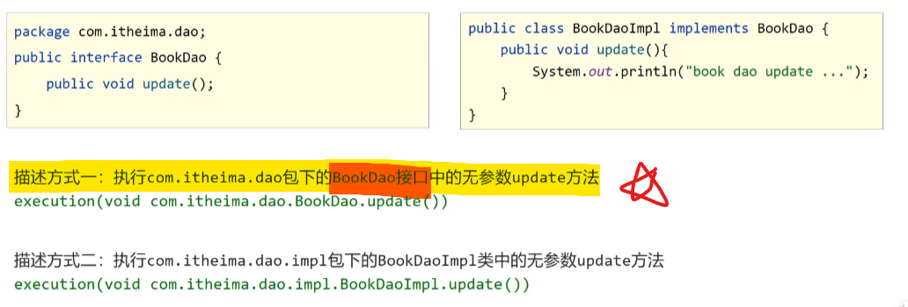
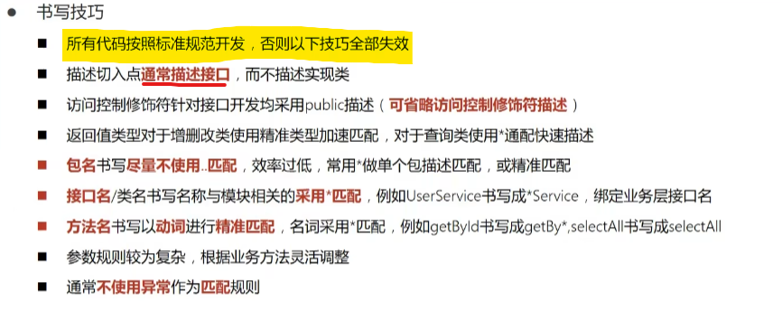

> + 切入点：要进行增强的方法
>
> + 切入点表达式：对要进行增强的方法的描述方式
>
>   

# 语法格式

+ 切入点表达式标准格式：动作关键词（访问修饰符 返回值 包名.类/接口名.方法名(参数) 异常名）

  ```java
  //访问修饰符一般都是public，克省略不写，除非它是private
  execution(public User com.rainfall.service.UserService.findById(int))
  ```

  + 动作关键词:描述切入点行为动作，例如execution表示执行到指定切入点
  + 访问修饰符：public、private等，可以省略
  + 返回值
  + 包名
  + 类/接口名
  + 方法名
  + 参数
  + 异常名：方法定义中抛出指定异常，可以省略

# 通配符

+ 可以使用通配符快速描述切入点

  + *：表示匹配**单个、独立的任意符号**，可以独立出现，也可以作为前缀或后缀的匹配夫出现

    ```java
    //表示匹配com.rainfall包下，任意包中的，UserService类中的，带有一个参数的，任意返回指的，findById方法
    execution(public * com.rainfall.*.UserService.findById(*))
    ```

    

  + ..：表示匹配**多个、连续的任意符号**，可以单独出现，常用于简化包名与参数的书写

    ```java
    //表示匹配com包下，任意包中的，UserService类中的，带有任意参数的，返回值为User类型的，findById方法
    execution(public User com..UserService.findById(..))
    ```

  + +：专用于匹配子类类型

    ```java
    //表示匹配任意包下的，以Service为结尾的接口或类的子类下的，任意参数，任意返回值的，任意方法
    execution(* *..*Service+.*(..))
    ```

# 书写技巧

