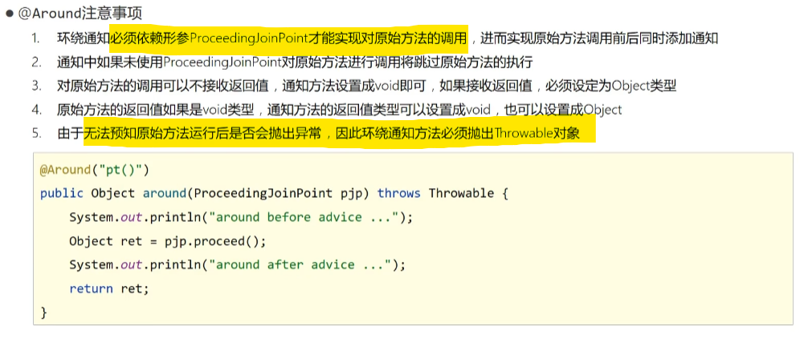

> 在以下示例中,切入点:
>
> ```java
> @Pointcut("execution(* com.rainfall.dao.BookDao.*())")
>     private void pt(){}
> ```
>
> 指向了com.rainfall.dao.BookDao下的任意返回值的任意无参方法(一个void update(),一个 int select())

# 前置通知

+ 使用@Before()标定切入点，表示在切入点目标方法执行前执行通知

  ```java
  @Before("pt()")
      public void before(){
          System.out.println("before advice...");
      }
  ```

# 后置通知

+ 使用@After()标定切入点，表示在切入点目标方法执行后执行通知（**不管目标方法是否正确执行**，完了就执行）

  ```java
  @After("pt()")
  public void after(){
      System.out.println("after advice...");
  }
  ```

# 环绕通知(重点)

+ 使用@Around()标定切入点，表示在切入点目标方法执行前、后都各执行一段通知

  ```java
  @Around("pt()")
  public Object around(ProceedingJoinPoint pjp) throws Throwable {
      System.out.println("around before advice...");
          //表示对原始操作的调用
      Object ret = pjp.proceed();
      System.out.println("around after advice...");
      return ret;
  }
  ```

  

  1. 在定义该通知时，如果切入点目标函数**无返回值则用void定义**通知，如果切入点目标函数**有返回值则用Object定义**通知（有无返回值其实都可以用Object定义，没什么问题）

  2. 通知方法要**传入ProceedingJoinPoint类型的对象参数**，并以该**对象参数调用切入点目标方法**，这样才能知道是在哪环绕

  3. 使用pjp.proceed()调用切入点目标方法（pjp为传入的对象参数），可用Object类型的参数接受返回值（从目标函数传过来的，强转成其他类型的也可以），最后return回去

  4. 要抛异常

  5. 可以**使用Signature接口获取关于目标方法的一些信息**

     ```java
     Signature signature = pjp.getSignature();
     
     //获取目标方法的方法名
     String name = signature.getName();
     
     //获取方法所在类位置及类的类型（类、接口..）
     Class declaringType = signature.getDeclaringType();
     
     //暂时不知道返回的是什么，但是和切入点有关
     int modifiers = signature.getModifiers();
     
     //获取方法所在类位置
     String declaringTypeName = signature.getDeclaringTypeName();
     ```

# 返回后通知(了解)

+ 使用@AfterReturning()标定切入点，与@After()用法类似，但只有目标方法正确执行完毕后才会执行（抛异常、报错什么的都不会执行）

  ```java
  @AfterReturning("pt()")
  public void afterRunning(){
      System.out.println("after running advice...");
  }
  ```

# 抛出异常后通知(了解)

+ 使用@AfterThrowing()标定切入点，表示在切入点目标方法抛出异常后才会执行通知

  ```java
  @AfterThrowing("pt()")
  public void afterThrowing(){
     System.out.println("after throwing advice...");
  }
  ```

  

