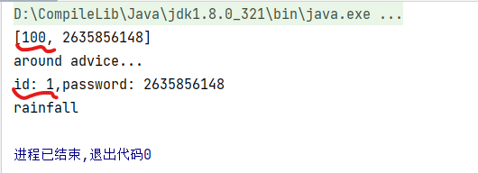

# AOP通知获取数据的类型及方法

+ [获取切入点方法的参数](#获取切入点参数)
  + JoinPoint：适用于前置、后置、返回后、抛出异常后通知
  + ProceedJoinPoint：适用于环绕通知
+ [获取切入点方法返回值](#获取切入点返回值)
  + 返回后通知
  + 环绕通知
+ [获取切入点方法运行异常信息](#获取切入点方法运行异常信息)
  + 抛出异常后通知
  + 环绕通知

## 获取切入点参数

+ 在通知方法内**传入JoinPoint joinPoint对象**，使用**joinPoint.getArgs()**可以获取**Object类型**的切入点参数

  ```java
  @Before("pointCut()")
  public void before(JoinPoint joinPoint){
      Object[] args = joinPoint.getArgs();
      System.out.println(Arrays.toString(args));
      System.out.println("before advice...");
  }
  ```

  + ProceedJoinPoint是JoinPoint的子接口，因此也可通过ProceedJoinPoint的对象**proceesJoinPoint.getArgs()获取切入点传入的参数**，但**ProceedJoiPoint只能使用于环绕通知中**

  + 环绕通知中，proceedJoinPoint.proceed()用来调用切入点方法，**默认不传参**(但**实际上是传入了切入点的参数**)，可以使**用新参数或改变了的args当作参数传入**，**可以替代切入点原有参数**(可以做一些判断操作看参数是否合规，虽然参数是否合规应该在切入点使用前就做)

    ```java
    //切入点原始传入的参数为[100,26358562148]
    @Around("pointCut()")
    public Object around(ProceedingJoinPoint pjp) throws Throwable {
        Object[] args = pjp.getArgs();
        //此处打印原有参数
        System.out.println(Arrays.toString(pjp.getArgs()));
        //此处将第一个参数改为1
        args[0] = 1;
        System.out.println("around advice...");
        Object ret = pjp.proceed(args);
        return ret;
    }
    ```

    

## 获取切入点返回值

+ 在环绕通知中，由于**调用切入点方法时就会返回切入点的返回值**（假如有的话），所以只要在调用方法时接收返回值即可

  ```java
  //pjp.proceed()值就是切入点返回值
  Object ret = pjp.proceed();
  return ret;
  ```

+ 在返回后通知时，由于**无法使用ProceedingJoinPoint pjp**，要在**通知方法参数中添加接收返回值的参数**，并将参数在**注解中标明是接收返回值的**

  + 注解中，**returning的值必须与下文中收返回值的参数名相同**，否则会找不到
  + 如果接收返回值时还**要使用Joinpoint的方法**，JoinPoint joinPoint必须放在最前面，如：**public void afterRunning(JoinPoint joinPoint,Object ret)**

  ```java
  //value值是切入点表达式（也可以用pointcut=“ex...”,麻烦，直接引用上文定义好的就行），returning值是返回值接收参数名
  @AfterReturning(value = "pointCut()",returning = "ret")
  public void afterRunning(Object ret) {
      System.out.println("after running advice...");
      System.out.println(ret);
  }
  ```

## 获取切入点方法运行异常信息

+ 在环绕通知时，由于调用切入点方法会**默认增加异常处理方法**，一般是在方法名上抛出，但若要使用异常信息就要**使用try-catch在方法内获取，这样才能在方法内使用**

  ```java
  @Around("pointCut()")
  public Object around(ProceedingJoinPoint pjp) {
      Object ret = null;
      //使用try-catch获取异常信息
      try {
          ret = pjp.proceed(args);
      } catch (Throwable e) {
          //在这里使用异常信息
          throw new RuntimeException(e);
      }
      return ret;
  }
  ```

+ 在异常后通知中，要使用注解中的**throwing属性标定接收异常信息的参数名**，还要在**通知方法内传入Throwable类型的异常信息接收参数**

  ```java
  @AfterThrowing(value = "pointCut()",throwing = "t")
  public void afterThrowing(Throwable t){
      System.out.println("after throwing advice...");
      //异常处理方法，不写了
      System.out.println(t);
  }
  ```

  

