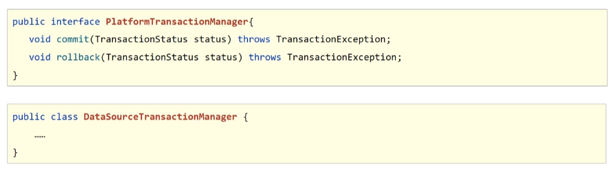
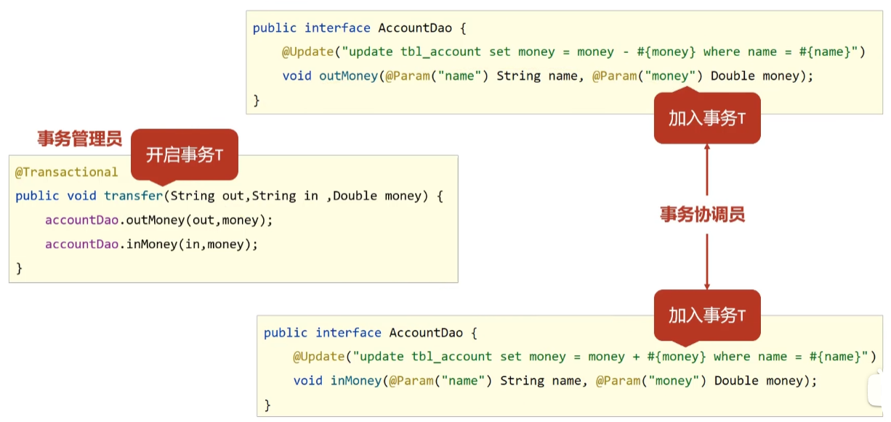

# 事务简介

+ 事务作用：在**数据层**保障一系列的**数据库操作同成功同失败**
+ Spring事务作用：在**数据层或业务层**保障一系列的**数据库操作同成功同失败**

+ 事务实现：



# Spring 事务实例

> 

+ 使用**@Transactional**在业务层接口上添加Spring事务管理

  ```JAVA
  @Service
  public interface AccountService {
      /*
      * 转账操作
      * @param out 转出方
      * @param in 转入方
      * @param money 转账金额
      * */
  
      @Transactional
      public void transfer(String out,String in,Double money);
  }
  ```

  > 注意：
  >
  > Spring注解事务**通常添加在业务层接口**而不会添加到业务层实现类中，降低耦合
  >
  > 注解式事务可以**添加到业务方法上表示*当前方法*开启事务**，也可以**添加到接口上表示当前*接口上所有方法*开启事务**

+ 设置事务管理器,并交由Spring容器管理

  ```java
  //MyBatis使用的是JDBC事务，所以事务管理器写在JdbcConfig.class中
  @Bean
  public PlatformTransactionManager platformTransactionManager(DataSource dataSource){
      DataSourceTransactionManager transactionManager = new DataSourceTransactionManager();
      transactionManager.setDataSource(dataSource);
      return transactionManager;
  }
  ```

  > 注意：
  >
  > 事务管理器要**根据实现技术进行选择**
  >
  > MyBatis框架使用的是JDBC事务

+ 使用**@EnableTransactionManagement**开启注解式事务驱动

  ```java
  //设置为配置类
  @Configuration
  //开启包扫描
  @ComponentScan("com.rainfall")
  //加载其他配置类
  @Import({MyBatisConfig.class, JdbcConfig.class})
  //加载properties资源文件
  @PropertySource("classpath:JDBC.properties")
  //开启注解式事务驱动
  @EnableTransactionManagement
  public class SpringConfig {
  }
  ```

  

# Spring事务角色

+ 事务角色

  + 事务管理员：事务发起方，在Spring中**通常指代业务层开启事务的方法**
  + 事务协调员：加入事务方，在Spring中**通常指代数据层方法**，**也可以是业务层方法**

  