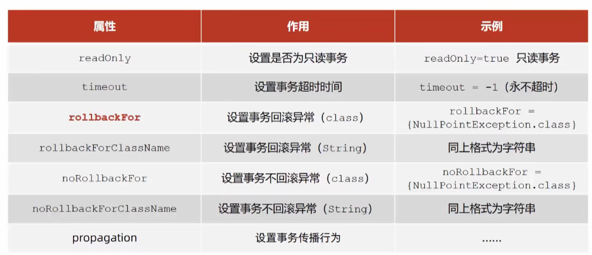
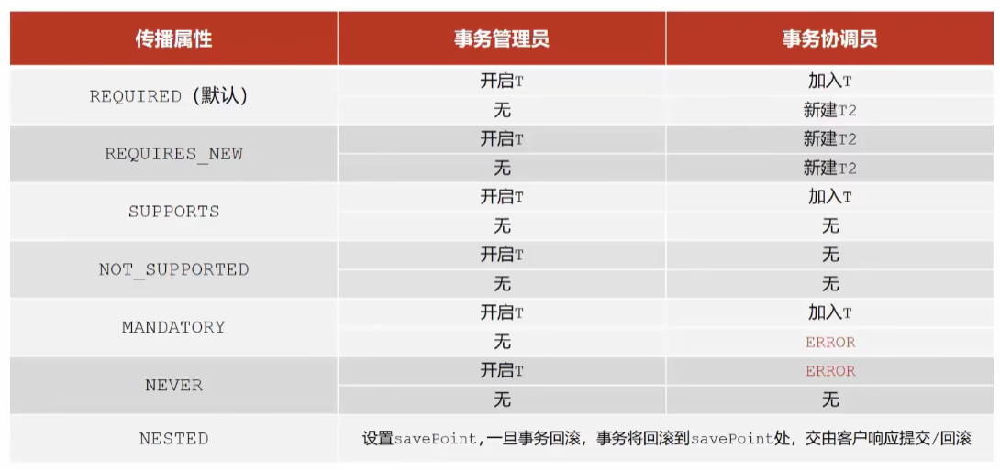

# 事务配置



+ 事务配置书写格式如下：

  ```java
  public interface AccountService {
      /*
      * 转账操作
      * @param out 转出方
      * @param in 转入方
      * @param money 转账金额
      * */
  
      @Transactional(readOnly = true,timeout = -1,rollbackForClassName = {"IOException"})
      public void transfer(String out,String in,Double money) throws Exception;
  }
  ```

# 事务传播行为

+  通过以下方法控制事务传播行为

  ```java
  @Transactional(propagation = Propagation.REQUIRES_NEW)
  void log(String out,String in,Double money);
  ```

  

  