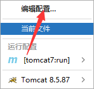
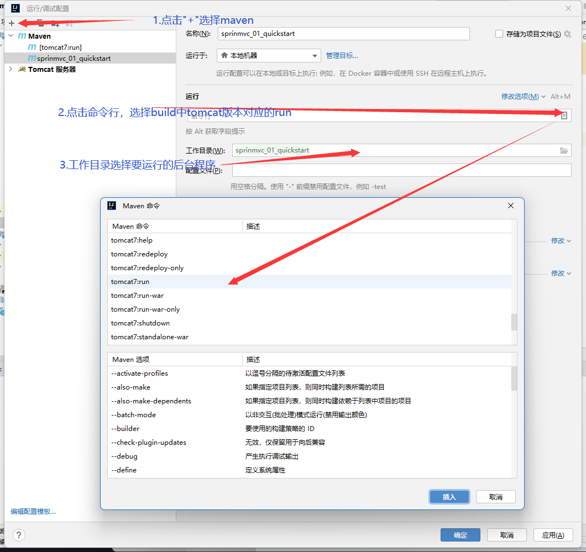
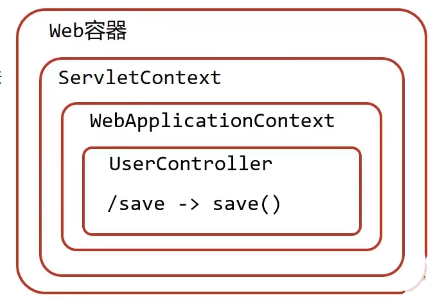

# SpringMVC运行环境配置

> + 如果要使开发的后台程序能够模拟运行在ide中，要安装tomcat服务器，在pom.xml中加入以下配置(与<dependencies></dependencies>同级)
>
> ```xml
> <build>
> <!--        <finalName>springmvc_03_request_mapping</finalName>-->
> 
>     <plugins>
>         <plugin>
>             <groupId>org.apache.tomcat.maven</groupId>
>             <artifactId>tomcat7-maven-plugin</artifactId>
>             <version>2.1</version>
>             <configuration>
>                 <port>80</port>
>                 <path>/</path>
>             </configuration>
>         </plugin>
>     </plugins>
> </build>
> ```
>
> + 接着点击：
>
>   
>
> + 再根据这张图操作：
>
>   

# SpringMVC基本使用

+ 导入SpringMVC依赖与Servlet依赖

  ```xml
  <!--    1.导入SpringMVC与Servlet依赖-->
  <dependency>
    <groupId>javax.servlet</groupId>
    <artifactId>javax.servlet-api</artifactId>
    <version>3.1.0</version>
    <scope>provided</scope>
  </dependency>
  
  <dependency>
    <groupId>org.springframework</groupId>
    <artifactId>spring-webmvc</artifactId>
    <version>5.2.10.RELEASE</version>
  </dependency>
  ```

+ 创建SpringMVC控制器类（等同于Servlet功能）

  ```java
  //2.定义controller
  //2.1.使用@Controller定义bean
  @Controller
  public class UserController {
  	//2.2.设置当前操作的访问路径
      @RequestMapping("/save")
      //2.3.设置当前操作的返回值类型
      @ResponseBody
      public String save(){
          System.out.println("user save...");
          return "{'module':'springmvc'}";
      }
  }
  ```

  

+ 初始化SpringMVC环境（同Spring环境），设定SpringMVC加载对应的bean

  ```java
  //3.创建springmvc的配置文件，加载controller对应的bean
  @Configuration
  @ComponentScan("com.rainfall.controller")
  public class SpringMvcConfig {
  }
  ```

  

+ 初始化Servlet容器，加载SpringMVC环境，并设置SpringMVC技术处理的请求

  ```java
  public class ServletContainersInitConfig extends AbstractDispatcherServletInitializer {
      //加载SpringMVC容器配置
      @Override
      protected WebApplicationContext createServletApplicationContext() {
          AnnotationConfigWebApplicationContext ctx = new AnnotationConfigWebApplicationContext();
          ctx.register(SpringMvcConfig.class);
          return ctx;
      }
  
      //设置哪些请求归属SpringMVC处理
      @Override
      protected String[] getServletMappings() {
          //表示所有请求归SpringMVC处理
          return new String[]{"/"};
      }
  
      //加载Spring容器配置
      @Override
      protected WebApplicationContext createRootApplicationContext() {
          return null;
      }
  }
  ```

# SpringMVC基本使用注解

+ **@Constroller：**

  + 类型：**类注解**

  + 位置：SpringMVC控制器**类定义上方**

  + 作用：设定SpringMVC的控制器bean

  + 示例：

    ```java
    @Controller
    public class UserController {
    }
    ```

+ **@RequestMapping：**

  + 类型：**方法注解**

  + 位置：SpringMVC控制器**方法定义上方**

  + 作用：设置当前控制器方法请求访问路径

  + 示例：

    ```java
    //2.2.设置当前操作的访问路径
    @RequestMapping("/save")
    //2.3.设置当前操作的返回值类型
    @ResponseBody
    public String save(){
        System.out.println("user save...");
        return "{'module':'springmvc'}";
    }
    ```

  + 相关属性：

    + value(默认)：请求访问路径

+ **@ResponseBody：**此处关于作用的解释不全面，[正确解释在此锚点目标的最下面](./18.SpringMVC响应)

  + 类型：**类注解**
  + 位置：SpringMVC控制器**类定义上方**
  + 作用：设置当前控制器方法**响应内容为当前方法返回值**，无需解析
  + 示例：在上面


# SpringMVC基本使用工作流程

+ 启动服务器初始化过程：

  1. Tomcat服务器启动，**执行ServletContainersInitConfig类**，初始化Web容器
  2. 执行类中**createServletApplicationContext()方法，创建WebApplicationContext对象**
  3. 通过AnnotationConfigWebApplicationContext的 对象**ctx.register(SpringMvcConfig.class)加载SpringMvcConfig配置类**
  4. 配置类中**@ComponentScan()加载对应的bean**
  5. bean**目标类UserController被加载**，每个**@RequestMapping的名称对应一个具体的方法**
  6. 执行ServletContainersInitConfig类中的**getServletMappings()方法，定义可以通过SpringMVC的请求**

+ 单次请求过程：

  1. 发送请求：localhost/save

  2. Web容器**判定请求须经过springMVC，将请求交由SpringMVC处理**

  3. **解析请求路径**/save

  4. 由/save**匹配执行对应的方法**save()

  5. **执行save()**

  6. 检测到**@ResponseBody注解，将save()方法的返回值作为响应请求体返回请求方**

     