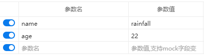
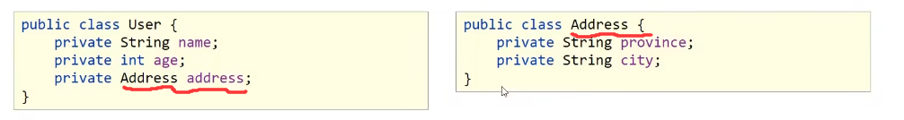
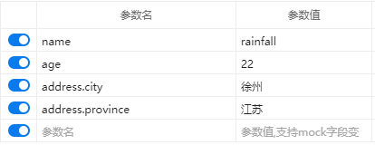
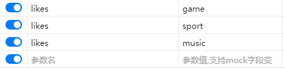
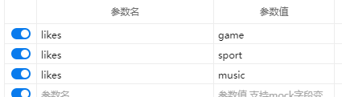
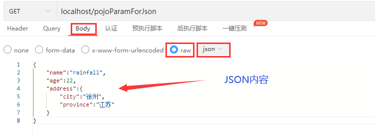

# 请求映射路径

+ 使用**@RequestMapping**定义请求访问路径：

  + 类型：**方法注解  类注解**

  + 位置：SpringMVC控制器方法定义上方

  + 作用：设置当前**控制器方法请求访问路径**，**如果在设置在类上**，则统一设置当前**控制器方法请求访问路径前缀**

  + 示例：

    ```JAVA
    @Controller
    //请求路径的前缀,在输入路径时要在下方的路径上加上这个前缀
    @RequestMapping("/user")
    public class UserController {
    
        @RequestMapping("/save")
        @ResponseBody
        public String save(){
            System.out.println("user save...");
            return "{'module':'user save'}";
        }
    
        @RequestMapping("/delete")
        @ResponseBody
        public String delete(){
            System.out.println("user delete...");
            return "{'module':'user delete'}";
        }
    }
    ```

# 请求参数接收

+ GET请求：将提交的参数及参数值写到url上，在原始url后添加“？”在添加参数，参数间以“&”分隔
+ POST请求：提交的参数及参数值会放到body中提交

## 基本数据类型的接收

### 普通参数的接收

+ **SpringMVC对普通参数的处理：**

  + 不管是POST请求还是GET请求，其所提交的参数都可**由提交路径对应方法的参数接收**
  + **提交的参数名尽量与方法的参数名一致**，否则会导致接收的参数为空，但可以使用**@RequestParam指定方法参数对应的接收参数名**

  ```java
  @RequestMapping("/commonParam")
  @ResponseBody
  //name与age接收post/get请求提交的参数
  public String commonParam(@Requestparm("name")String userName,Integer age){
      System.out.println("普通参数传递：userName->"+userName);
      System.out.println("普通参数传递：age->"+age);
      return "{'module':'common param'}"+name+'\t'+age;
  }
  ```

  

+ SpringMVC解决**POST请求中文乱码问题(只能POST，GET不行)：**

  + 在Servlet容器中添加字符集过滤器，将提交的参数转化为所使用的编码格式（一般是UTF-8）
  + 注：不改变编码格式，传进来的中文是乱码，改变编码格式，传出去的中文是“？”，不过不用担心，以后往前传的就是JSON了，不是字符串

  ```java
  public class ServletContainersInitConfig extends AbstractAnnotationConfigDispatcherServletInitializer {
          //乱码处理
      //字符集过滤器
      @Override
      protected Filter[] getServletFilters() {
          CharacterEncodingFilter filter = new CharacterEncodingFilter();
          filter.setEncoding("UTF-8");
          return new Filter[]{filter};
      }
  }
  ```

+ **@RequestParam**

  + 类型：**形参注解**

  + 位置：SpringMVC控制器方法形参定义前面

  + 作用：绑定请求参数与处理器方法形参间的关系

  + 示例：在上面

  + 参数：

    + required：是否为必要参数
    + defaultValue：参数默认值

### POJO类型的参数

+ pojo参数：**请求参数名**与**形参对象属性名相同**，定义**POJO类型形参即可接收参数**

  

  ```java
  //pojo参数
  @RequestMapping("/pojoParam")
  @ResponseBody
  //将映射路径方法参数定义为POJO类型的参数接收
  public String pojoParam(User user){
      System.out.println("pojo参数传递：user->"+user);
      return "{'module':'pojo param'}";
  }
  ```

+ 嵌套POJO参数：POJO对象中包含POJO对象(接收和上面一样，传入不一样)

  

  + **请求参数名**与**形参对象属性名相同**，按照对象的层次关系即可嵌套POJO属性参数

    

    ```java
    //嵌套pojo参数
    @RequestMapping("/pojoContainPojoParam")
    @ResponseBody
    public String pojoContainPojoParam(User user){
        System.out.println("pojo参数传递：user->"+user);
        return "{'module':'pojo contain pojo param'}";
    }
    ```

### 数组类型的参数

+ 数组参数：**请求参数名**与**形参数组对象属性名相同**且**请求参数为多个**，定义数组类型形参即可接收参数（**数组对象名必须和传入的参数名相同**）

  

  ```java
  //数组参数
  @RequestMapping("/arrayParam")
  @ResponseBody
  //将形参定义为数组类型即可接收同属性名的多个参数
  public String arrayParam(String[] likes){
      System.out.println("数组参数传递：array->"+ Arrays.toString(likes));
      return "{'module':'array param'}";
  }
  ```

### 集合类型的参数

+ 集合保存普通参数：**请求参数名**与**形参集合对象属性名相同**且**请求参数为多个**，定义集合类型形参即可接收参数（**集合对象名必须和传入的参数名相同**）

  + 使用集合对象接收参数必须使用@RequestParam绑定

  

  ```java
  //集合参数
  @RequestMapping("/listParam")
  @ResponseBody
  //传入参数必须使用@Requestparam绑定，否则会报错
  public String arrayParam(@RequestParam List<String> likes){
      System.out.println("集合参数传递：array->"+ likes);
      return "{'module':'list param'}";
  }
  ```

## JSON型数据接收

> + 使用JSON文件要导入对应的依赖(默认情况下SpringMVC使用jackson的JSON解析器，但为了解析速度建议使用fastjson，但有被黑客攻击的风险)
>
>   ```xml
>   <!--        JSON数据转换依赖-->
>   <!--        默认情况下导入jackson依赖-->
>   <!--        <dependency>-->
>   <!--            <groupId>com.fasterxml.jackson.core</groupId>-->
>   <!--            <artifactId>jackson-databind</artifactId>-->
>   <!--            <version>2.9.0</version>-->
>   <!--        </dependency>-->
>   
>   <dependency>
>   	<groupId>com.alibaba</groupId>
>   	<artifactId>fastjson</artifactId>
>   	<version>1.2.60</version>
>   </dependency>
>   ```
>
> + 使用fastjson依赖修改SpringMVC配置，具体方法如下：
>
>   1. SpringMVC配置类实现接口WebMvcConfigurer下的configureMessageConverters()方法
>   2. 配置MediaType(1.1.41及以下的版本不用配置，以上不配置会报错)
>
>   ```java
>   //实现WebMvcConfigurer接口
>   public class SpringMvcConfig implements WebMvcConfigurer {
>       //实现configureMessageConverters()方法
>       @Override
>       public void configureMessageConverters(List<HttpMessageConverter<?>> converters) {
>         
>   //        获取fastjson的实例对象，并作一些配置
>           FastJsonHttpMessageConverter converter = new FastJsonHttpMessageConverter();
>           //添加MediaType的配置
>                   converter.setSupportedMediaTypes(getSupportMediaType());
>           //配置默认字符信息
>           converter.setDefaultCharset(StandardCharsets.UTF_8);        
>           //其实这里最好使用FastJsonConfig配置fastjson，并使用converter.setFastJsonConfig()添加配置信息，但com.alibaba.fastjson.support.config.FastJsonConfig包死活导不进去，没法配置
>         
>           //将converter加入Springmvc的json解析器
>           converters.add(0,converter);
>       }
>         
>       //配置MediaType（支持的媒体类型）
>       private List<MediaType> getSupportMediaType(){
>           List<MediaType> mediaTypes = new ArrayList<>();
>           mediaTypes.add(MediaType.APPLICATION_JSON);
>           mediaTypes.add(new MediaType("application","*+json"));
>           return mediaTypes;
>       }
>   
>   
>   }

+ 第一步：**导入JSon解析器依赖**，上面已经说过了

+ 第二步：发送请求的JSON格式数据（get/post无所谓）

  

+ 第三步：再SpringMVC**配置类中开启自动转换**json数据的支持

  + 注：@EnableWebMvc功能强大，本功能只是一部分

  ```java
  //定义为配置类
  @Configuration
  //扫包
  @ComponentScan("com.rainfall.controller")
  //开启JSON数据转换为对象的功能
  @EnableWebMvc
  public class SpringMvcConfig implements WebMvcConfigurer {
  }
  ```

+ 第四步：接收JSON数据

  + 因为**JSON数据都是放到请求的Body内**，所以**使用@RequestBody标记接收参数**（请求参数名和接收参数名不同使用的是<u>@RequestParam</u>）

  ```java
  //集合参数：json格式
  @RequestMapping("/listParamForJson")
  @ResponseBody
  public String listParamForJson(@RequestBody List<String> likes){
  	System.out.println("list common(json)参数传递：list->"+ likes);
  	return "{'module':'list common for json'}";
  }
  ```

+ 使用到的注解：

  1. @EnableWebMvc：

     + 类型：**配置类注解**
     + 位置：SpringMVC配置类定义上方
     + 作用：开启SpringMVC多项辅助功能（本节中使用其开启JSON自动转换对象功能）
     + 示例：上述第三步

  2. @RequestBody：

     + 类型：**形参注解**
     + 位置：SpringMVC控制器方法形参定义前面
     + 作用：将请求中**请求体包含的数据传递给接收参数**，此注解一个处理器方法只能使用一次
     + 示例：上述第四步

## 日期型参数接收

+  日期类型数据基于系统不同有不同的格式

  + 2023-03-08
  + 2023/03/08
  + 03-08-2023

+ 接收日期型参数时，使用**@DateTimeFormat(pattern=“”)标定接收参数会接收到的日期格式**

  + 请求**发送的日期格式**要与此处**标定的日期格式一致**，不然会报错，因此在前端开发时就要规定好日期格式

  ```java
   //日期格式参数
  @RequestMapping("/dateParam")
  @ResponseBody
  public String dateParam(@DateTimeFormat(pattern = "yyyy/MM/dd HH:mm:ss") Date date){
      System.out.println("日期型参数传递：date --> "+date);
      return "{'module':'date param'}";
  }
  ```


+ @DateTimeFormat:
  + 类型：**形参注解**
  + 位置：SpringMVC控制器方法**形参前面**
  + 作用：设置**日期时间型数据格式**
  + 示例：上面
  + 属性：patter：日期时间格式字符串（yyyy-MM-dd HH:mm:ss,”-”可以换成“/”）
