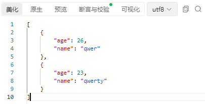

# 响应

+ 对页面的响应：

  + **不使用@ResponseBody注解**，**浏览器会将返回的字符串当成一个页面跳转响应**（一般页面跳转可以直接在前端实现，所以这个用法用处不大）

  ```java
  //响应页面/跳转页面
  @RequestMapping("/toJumpPage")
  public String toJumpPage(){
      System.out.println("跳转页面");
      return "index.jsp";
  }
  ```

  + 注：因为**SpringMVC被设置会拦截处理所有请求**，因此浏览器对**静态页面**的请求如果**不经此方法会无法访问**，所以要设置SpringMVC不拦截静态资源访问

    1. 创建类SpringMvcSupport**继承WebConfigurationSupport**
    2. **实现addResourceHandlers方法**
    3. **添加可以绕过SpringMVC拦截器的路径**
    4. 将改类定义为配置类并加载
    5. 注意：使用@EnableWebMvc注解后，@Import方式添加配置类的方式就会失效，老老实实扫包吧
    6. 注意：这样做完后fastjson对**对象与JSON互相转换的功能**貌似是**会挂掉**的，所以这里推荐jackson（已经找到的解决方法：该方法可以通过**SpringMvcConfig类**实现**WebMvcConfigurer**的同名方法起到同样的作用，这样**不会与fastjson冲突**，但这样会**增强代码的侵入性**）
    
    ```java
    @Configuration
    public class SpringMvcSupport extends WebMvcConfigurationSupport {
        @Override
        protected void addResourceHandlers(ResourceHandlerRegistry registry) {
    //        当访问/pages/？？时，走/pages目录下的内容
            registry.addResourceHandler("/pages/**").addResourceLocations("/pages/");
            registry.addResourceHandler("/js/**").addResourceLocations("/js/");
            registry.addResourceHandler("/css/**").addResourceLocations("/css/");
            registry.addResourceHandler("/plugins/**").addResourceLocations("/plugins/");
        }
    }
    ```
    
    

+ 响应文本（字符串）数据：

  + 使用@ResponseBody，设置**控制器方法的返回值作为响应体**，如果**返回值是简单数据，则返回字符串**，如果是**返回集合对象，则返回json数据**

  ```java
  //响应文本数据
  @RequestMapping("/toText")
  @ResponseBody
  public String toText(){
     System.out.println("返回纯文本数据");
      //由于返回值不是集合对象，响应体实际上是一个字符串
      return "response text";
  }
  ```

+ 响应JSON数据

  + 以下两端代码返回值为对象或集合对象，响应体为json数据

  ```java
  //响应返回值为POJO对象
  @RequestMapping("/toJsonPojo")
  @ResponseBody
  public User toJsonPojo(){
      System.out.println("返回json对象数据");
  
      User user = new User();
      Address address = new Address();
  
      user.setName("rainfall");
      user.setAge(22);
      address.setCity("就案发");
      address.setProvince("江苏");
      user.setAddress(address);
  
      return user;
  }
  ```

  ```java
  //响应POJO集合对象
  @RequestMapping("/toJsonList")
  @ResponseBody
  public List<User> toJsonList(){
      System.out.println("返回json集合数据");
  
      User user1 = new User();
      User user2 = new User();
  
      user1.setName("qwer");
      user1.setAge(26);
  
      user2.setName("qwerty");
      user2.setAge(23);
  
      ArrayList<User> list = new ArrayList<>();
      list.add(user1);
      list.add(user2);
  
      return list;
  }
  ```

  + 其响应体结果之一：

  

+ @ResponseBody:

  + 类型：方法注解
  + 位置：SpringMVC控制器方法定义上方
  + 作用：设置当前控制器返回值作为响应体
  + 示例：上面都是
