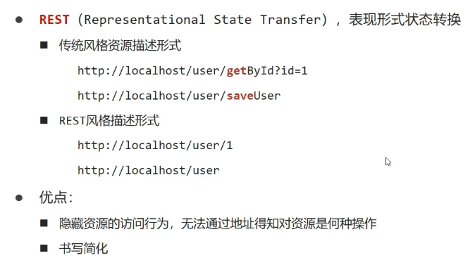
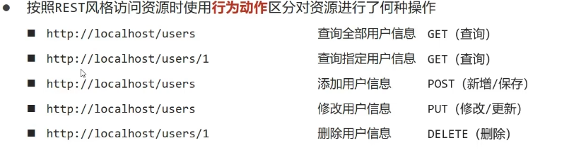

> + REST开发只是一种开发风格，并不是一种开发规范（但这种开发风格使用的人越来越多，有成为规范的势头）
>
>   
>
> + REST风格访问资源时使**用行为动作区分**对资源进**行了何种操作**（以下图示虽然URL相同，但提交方式不同，因此访问了不同的资源）
>
>   
>
> + **注：**模块名称因为表示的是一类资源，所以通常是复数形式，如：users、books

# REST使用案例

> + 将使用以下几个案例解释REST风格使用
> + **注意：REST不适合Controller类里*控制器方法贼多*的开发**

1. 资源访问不需要参数：

   + 将访问路径修改为统一的资源访问类
   + 在**@RequestMapping注解中使用method属性添加访问访问方式**
   + 此时，该资源访问路径为：http://localhost/users,提交方式为post

   ```java
   //表示users资源路径下，使用post方式提交的请求定位到此控制器访问方法
   @RequestMapping(value = "/users",method = RequestMethod.POST)
   @ResponseBody
   public String save(){
       System.out.println("user save...");
       return "{'module':'user save'}";
   }
   ```

2. 资源访问需要参数：

   + 在统一资源访问路径后再添加要传入的参数
   + 添加访问方式，如果**URL不与其他控制器相同**，则**提交方式可**与其他控制器提交方式**相同**
   + 再控制器的形参上**使用@PathVariable标记形参值来自访问路径**
   + 此时，该资源访问路径为：http://localhost/users/(此处填写一个id值),提交方式为delete

   ```java
   
   @RequestMapping(value = "/users/{id}",method = RequestMethod.DELETE)
       @ResponseBody
       public String delete(@PathVariable Integer id){
           System.out.println("user delete..."+id);
           return "{'module':'user delete'}";
       }
   ```

3. 资源访问需要的参数是POJO对象：

   + 不用再URL中额外添加路径
   + POJO对象将以JSON格式传入，所以需要@RequestBody标记控制器方法形参 

   ```java
   @RequestMapping(value = "/users",method = RequestMethod.PUT)
   @ResponseBody
   //别傻呗再忘了这个@RequestBody
   public String update(@RequestBody User user){
       System.out.println("user update..."+user);
       return "{'module':'user update'}";
   }
   ```
   
   
   
   