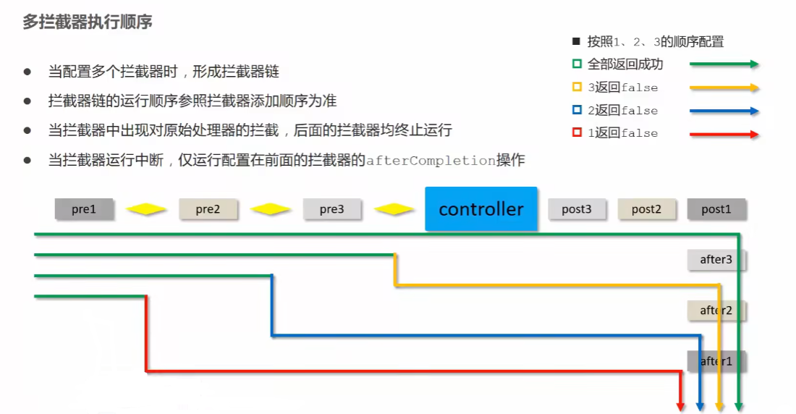

> 拦截器(interceptor)的**本质是AOP思想**，通过拦截器可以通过在**要执行的方法前、后以及结束后增添功能**的方式，实现对原有方法的增强

# 拦截器的使用

+ 拦截器大部分是作用于表现层的，所以可以在controller下建包，通过**实现HandlerInterceptor接口内的三个方法**实现对原有功能的增强

  + 使用**@Component****将该类注册为Bean才能使用**
  + 三个方法不一定是非得都要实现的，根据需求使用
  + **preHandler()方法返回值决定原有方法是否会执行**
  + 三个方法分别运行于原方法的前、后、执行完毕后

  ```java
  //注册为bean，交给容器管理
  @Component
  public class ProjectInterceptor implements HandlerInterceptor {
      public boolean preHandle(HttpServletRequest request, HttpServletResponse response, Object handler) throws Exception {
          System.out.println("preHandle");
          //此返回值决定原方法是否会执行
          return true;
      }
  
      public void postHandle(HttpServletRequest request, HttpServletResponse response, Object handler, ModelAndView modelAndView) throws Exception {
          System.out.println("postHandle");
      }
  
      public void afterCompletion(HttpServletRequest request, HttpServletResponse response, Object handler, Exception ex) throws Exception {
          System.out.println("afterCompletion");
      }
  }
  ```

+ 扫包：在SpringMVC配置类中将该包扫描(因为interceptor包放在controller包下，所以不用再添加了)

  ```java
  @ComponentScan({"com.rainfall.controller"})
  ```

+ 新建类**继承WebMvcConfigurationSupport**或使用**SpringMvcConfig类实现WebMvcConfigurer接口**（推荐使用接口，不会和fastjson冲突，但侵入性会增强），并重写/实现其下的**addInterceptors()方法**，将拦截器注册使用，并为其标定作用范围（请求那个路径时拦截器生效）

  ```java
  //自动装配要注册的拦截器对象
  @Autowired
  private ProjectInterceptor projectInterceptor;
  
  @Override
  //WebMvcConfigurationSupport父类和WebMvcConfigurer接口中都有
  public void addInterceptors(InterceptorRegistry registry) {
      //拦截器对象注册并划定作用范围
      registry.addInterceptor(projectInterceptor).addPathPatterns("/books", "/books/*");
  }
  ```

# 拦截器方法的参数

## 前置拦截器参数

```java
public boolean preHandle(HttpServletRequest request, HttpServletResponse response, Object handler) throws Exception {
    System.out.println("preHandle");
    //此返回值决定原方法是否会执行
    return true;
}
```

+ 参数：
  + request：请求对象
  + response：响应对象
  + handler：被调用的处理器对象，本质上是一个方法对象，对反射技术中的Method对象进行了再包装
+ 返回值：
  + 返回值为fanlse，被拦截的处理器方法将不再执行

## 后置拦截器

```java
public void postHandle(HttpServletRequest request, HttpServletResponse response, Object handler, ModelAndView modelAndView) throws Exception {
    System.out.println("postHandle");
}
```

+ 参数：
  + modleAndView：如果处理器执行完具有返回结果，可以读取到对应数据与页面信息，并进行调整

## 完成后拦截器

```java
public void afterCompletion(HttpServletRequest request, HttpServletResponse response, Object handler, Exception ex) throws Exception {
    System.out.println("afterCompletion");
}
```

+ 参数：
  + ex如果执行过程中出现异常，可以针对异常情况进行单独处理（不过使用了异常处理器类对异常进行统一处理，这个基本用不到了）

# 拦截器链

## 拦截器链 的配置方式

+ **新建多个interceptor类**，再在加载方法中**按照一定顺序将拦截器类加载**

```java
    //自动装配拦截器对象
    @Autowired
    private ProjectInterceptor projectInterceptor;
    @Autowired
    private ProjectInterceptor2 projectInterceptor2;
    @Autowired
    private ProjectInterceptor3 projectInterceptor3;

    //加载拦截器
    @Override
    public void addInterceptors(InterceptorRegistry registry) {
        //加载拦截器1
        registry.addInterceptor(projectInterceptor).addPathPatterns("/books", "/books/*");
        //加载拦截器2
        registry.addInterceptor(projectInterceptor2).addPathPatterns("/books", "/books/*");
        //加载拦截器3
        registry.addInterceptor(projectInterceptor3).addPathPatterns("/books", "/books/*");
    }
```

## 拦截器的运行顺序

+ 参照下图：

  


