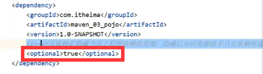
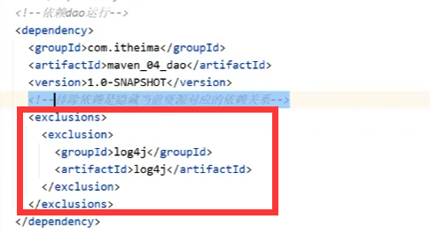

# 分模块开发

+ 创建Maven模块
  + Ctrl + Shift + Alt + S ，选择模块，新建模块，以quickstart为模板创建jar模块(千万别创建成web模块，不然打包成war包依赖不上)
+ 编写新模块代码
  + 分模块开发需要先针对模块功能进行设计，再进行编码。不会将项目开发完毕，然后再进行拆分
+ 通过maven指令将模块安装到本地长裤（install指令）
+ 

# 依赖传递

## 依赖冲突问题

+ **项目依赖具有传递性**，即a依赖b，而b依赖c，则a也会依赖c
+ 项目依赖传递冲突问题：
  + 路径优先：当**依赖中出现相同的资源**时，**层级越深，优先级越低，层级越浅，优先级越高**
  + 声明优先：当**资源在相同层级**被依赖时，**配置顺序靠前的覆盖配置顺序靠后的**
  + 特殊优先：当相同层级配置了**同资源的不同版本**，**后配置的覆盖先配置的**

## 可选依赖与排除依赖

+ **可选依赖：**在依赖的传递过程中，**可选依赖可以切断该依赖的传递性**，使其仅在本层级中被依赖，而在上一层级不被依赖（即a依赖b，b依赖c，若b 中将对c的依赖标记为可选依赖，则a不会直接或间接依赖c。注：**这是在b中操作的**）

  + 在<dependency>中使用**<optional>true</optional>**将该依赖标记为可选依赖
  + 这个方法只适用于自己定义的被依赖模块（毕竟别人写的依赖你不能去maven库里改别人源码）
  
  
  
+ **排除依赖：**在当前的依赖配置关系中，**将不需要的间接依赖排除掉**（即a依赖b，b依赖c，若在a中将b的依赖c排除，则a不会直接或间接依赖c。注：这是在a中操作的）

  + 要排除哪个间接依赖，就将其放在<exclusions><exclusions>依赖信息(groupId、artifactId)</exclusions></exclusions>

  

# 继承与聚合

##　聚合

> 　多模块项目中，假如**一个模块发生了更改**，那么，**其他模块对该模块的依赖也应该相应的改变**，因此引入了聚合的概念

+ 创建maven模块，在pom.xml文件中将其打包方式设置为pom（其实就是将其设置为父项目）

  ```xml
  <!--    1.设置打包方式为聚合模式-->
      <packaging>pom</packaging>
  ```

+ 设置当前聚合项目包含的子模块名称

  + 聚合项目中所包含的模块在进行构建时会**根据模块间的依赖关系设置构建顺序**
  + 参与聚合项目的项目**无法向上感知是否参与聚合**，**只能向下配置哪些模块参与本项目的聚合**

  ```xml
  <!--    2.设置管理的模块名称-->
      <modules>
          <module>../maven_02_ssm</module>
          <module>../maven_03_pojo</module>
          <module>../maven_04_dao</module>
      </modules>
  ```

## 继承

> + 继承描述的是两个项目之间的关系，子项目可继承父项目中的配置信息
> + 作用：
>   + 简化配置
>   + 减少版本冲突

+ 创建maven模块，在pom.xml文件中将其打包方式设置为pom（其实就是将其设置为父项目）

  ```XML
  <!--    1.设置打包方式为聚合模式-->
      <packaging>pom</packaging>
  ```

+ 在父项目的pom.xml文件中配置依赖关系，依赖继承分为两种，直接继承和选择继承

  + **直接继承：**父项目直接写在<dependencies></dependencies>中的**依赖关系将被子项目直接继承**

  ```xml
   <dependencies>
      <!--        Spring相关-->
      <dependency>
          <groupId>org.springframework</groupId>
          <artifactId>spring-webmvc</artifactId>
          <version>5.2.10.RELEASE</version>
      </dependency>
  	......
       ......
  </dependencies>
  ```

  

  + **选择继承：**父项目写在<dependencyManagement></dependencyManagement>中的依赖关系，**子项目可选择是否继承**

  ```xml
  <dependencyManagement>
      <dependencies>
          <!--        junit单元测试-->
          <dependency>
              <groupId>junit</groupId>
              <artifactId>junit</artifactId>
              <version>4.12</version>
              <scope>test</scope>
          </dependency>
      </dependencies>
  </dependencyManagement>
  ```

+ 在**子项目中定义要继承的父项目**：

  ```xml
  <!--    配置当前项目继承自父项目-->
  <parent>
      <groupId>com.rainfall</groupId>
      <artifactId>maven_01_parent</artifactId>
      <version>1.0-SNAPSHOT</version>
      <!--填写父项目的pom文件位置，可以不写-->
      <relativePath>../maven_01_parent/pom.xml</relativePath>
  </parent>
  ```

+ 在子项目中配置父项目中的可选依赖

  + 可选依赖**只用写入groupId和ArtifactId**，依赖版本继承自父项目

  ```xml
  <dependency>
      <groupId>junit</groupId>
      <artifactId>junit</artifactId>
      <scope>test</scope>
  </dependency>
  ```

# 属性

## Maven自带属性配置

> maven中定义的属性相当于java开发中的参数，定义了属性可以有效地将属性值复用（这在更换某些依赖群的版本使很好用）

+ 定义属性：

  + **使用<properties></properties>包围要定义的属性**，属性名可以自定义

  ```xml
  <!--    定义属性-->
      <properties>
          <spring.version>5.2.10.RELEASE</spring.version>
      </properties>
  ```

+ 使用属性

  + 在要使用属性的地方**使用${properties.name}可以调用属性值**

  ```xml
  <dependency>
      <groupId>org.springframework</groupId>
      <artifactId>spring-webmvc</artifactId>
      <version>${spring.version}</version>
  </dependency>
  ```


## Maven属性配置项目

> 留底，还没写

# 多环境开发

## 多环境开发配置

+ 定义多个环境

  ```xml
  <!--    配置多环境-->
  <profiles>
  <!--        具体的一个环境：开发环境-->
      <profile>
  <!--		定义环境对应的唯一名称-->        
          <id>env_dep</id>
  <!--		定义该环境下专用的属性值-->        
          <properties>
              <spring.version>5.2.10.RELEASE</spring.version>
              <jdbc.url>jdbc:mysql://localhost:3306/mybatis?useSSL=false&amp;useUnicode=true&amp;characterEncoding=UTF-8</jdbc.url>
          </properties>
  
          <activation>
  <!--        设置是否为默认环境-->
              <activeByDefault>true</activeByDefault>
          </activation>
      </profile>
  
  <!--        具体的一个环境：生产环境-->
      <profile>
          ....
      </profile>
  </profiles>
  ```

+ 使用多环境（构建过程）

  + 使用以下方式切换多环境

  ```xml
  	mvn 指令 -P 环境id
  示例：
  	mvn install -P env_pro(在install过程中使用生产环境)
  ```

## 跳过测试

> 应用场景：
>
> + 功能更新并且没有开发完毕，因此会测试不通过不能打包，而此时想要进行线上测试
> + 快速打包
> + ......

1. 指令方法跳过测试

   + 使用以下方法跳过测试

   ```xml
   	mvn 指令 -D skipTests
   示例：
   	mvc install -D skipTests（在install过程中跳过测试）
   ```

2. 细粒度控制跳过测试

   + 添加并配置以下插件跳过测试

   ```xml
   <!--    细粒度控制跳过测试-->
   <plugin>
       <groupId>org.apache.maven.plugins</groupId>
       <artifactId>maven-surefire-plugin</artifactId>
       <version>2.22.1</version>
       <configuration>
   <!--        设置跳过测试-->
           <skipTests>true</skipTests>
   <!--        包含指定的测试用例-->
           <includes>
           	<include>**/User*Test.java</include>
           </includes>
   <!--        排除指定的测试用例-->
           <excludes>
               <exclude>**/User*TestCase.java</exclude>
           </excludes>
       </configuration>
   </plugin>
   ```

   # 私服

   > 暂且不写，留坑

