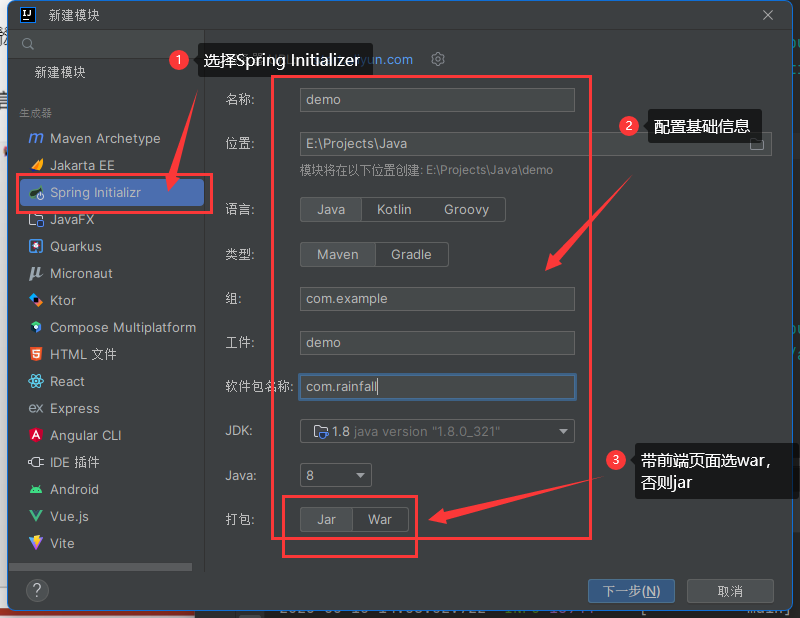
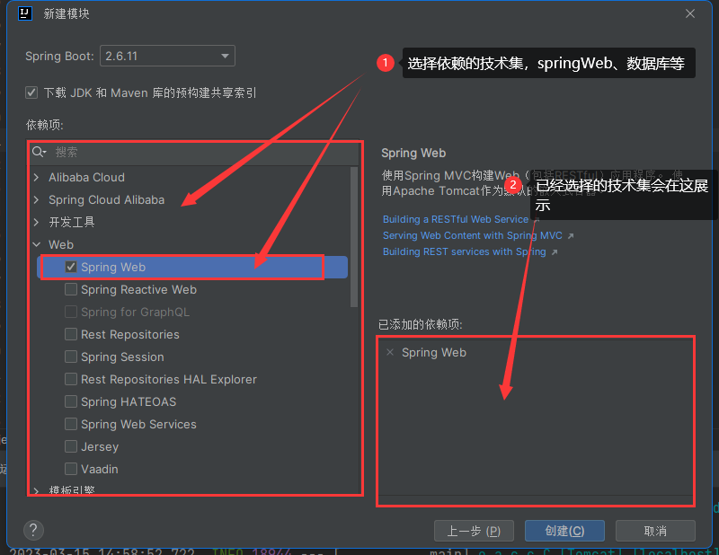
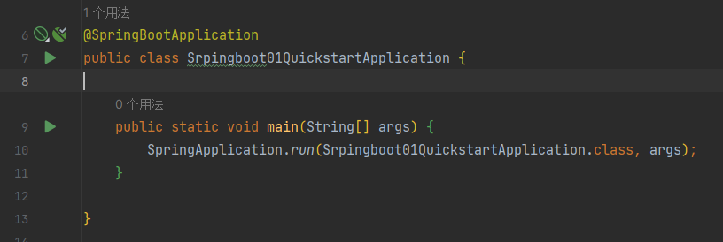
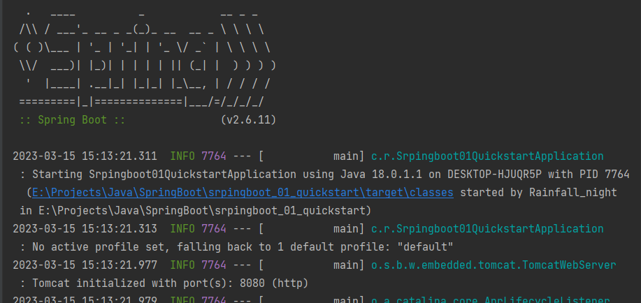

> SpringBoot真牛

# 创建SpringBoot项目

1. 创建新模块，**选择Spring Initlalizer** 并配置相关模块信息

   

2. 选择当前模块使用的技术集

   

3. 开发控制器类

   ```java
   @RestController
   @RequestMapping("/books")
   public class BookController {
   
       @GetMapping("/{id}")
       public String getById(@PathVariable Integer id){
           System.out.println("id --> "+ id);
           return "hello, spring boot!";
       }
   }
   ```

4. 运行自动生成的Application类

   

   