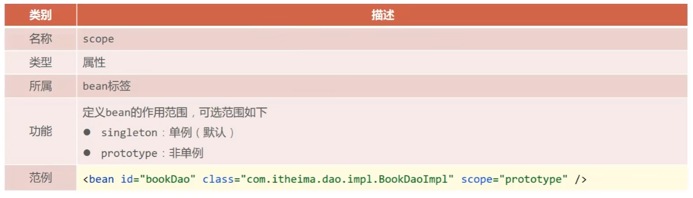

# bean在xml文件下的配置

## bean基础配置


## bean别名配置


## bean作用范围配置



> 当***scope=“prototype”***时，该bean对应的类的多个对象**指向不同的地址**，即创建的对象是不同的对象，而当***scope=“singleton”***时，该bean对应的类的多个对象***指向相同的地址***，即创建的对象是不同的对象

# bean实例化

## 构造方法实例化bean

+ 提供可访问的构造方法，在容器中配置好，再从容器中获取bean

  ```java
  public class BookDaoImpl implements BookDao{
      //构造函数（没内容可以不写）,该构造函数要能够无参访问，private/public无所谓
      public BookDaoImpl(){
          
      }
      //接口实现函数
      public void save(){
          System.out.println("book dao save ...");
      }
  }
  ```

+ 配置

  ```xml
  <bean
        id="bookDao"
        class="com.itheima.dao.impl.BookDaoImpl"
        />
  ```

+ 无参构造方法如果不存在，将抛出异常BeanCreationException（bean创建异常）

+ 运行

  ```java
  public class AppForInstanceBook{
      public static void main(String[] args){
          //此方法下不使用bean来实例化
          //BookDao bookDao = new BookDaoImpl();
          //bookDao.save();
          
          ApplicationContext ctx = new ClassPathXmlApplicationContext("applicationContext.xml");
          BookDao bookDao = (BookDao)ctx.getBean("bookDao");
          bookDao.save();
      }
  }
  ```

  

  

## 静态工厂实例化bean（了解，目前不常用）

+ 创建静态工厂

  ```java
  public class OrderDaoFactory{
      //静态工厂，用static修饰
      public static OrderDao getOrderDao(){
          //可以写一些功能配置
          
          //OrderDaoImpl()有内容
          return new OrderDaoImpl();
      }
  }
  ```

+ 配置工厂bean

  ```xml
  <bean
        id="orderDao"
        <!--定位到静态工厂类-->
        class="com.itheima.factory.OrderDaoFactory"
  	  <!--定位到工厂类实例化目标Dao的函数名-->
        factory-method="getOrderDao"
        />
  ```

+ 运行

  ```java
  public class AppForInstanceBook{
      public static void main(String[] args){
          //此方法下不使用bean来实例化
          //通过静态工厂创建对象
          //OrderDao orderDao = OrderDaoFactory.getOrderDao();
          //orderDao.save();
          
          ApplicationContext ctx = new ClassPathXmlApplicationContext("applicationContext.xml");
          OrderDao orderDao = (OrderDao)ctx.getBean("orderDao");
          orderDao.save();
      }
  }
  ```

  

## 实例工厂实例化bean(了解)

+ 创建实例工厂

  ```java
  public class UserDaoFactory{
      //实例工厂，要先将实例工厂类实例化才能调用其实方法
      public UserDao getUserDao(){
          return new UserDaoImpl();
      }
  }
  ```

+ 配置

  ```xml
  <!--实例工厂为非静态方法，要先实例化类才能调用-->
  <bean 
        id="userDaoFactory" 
        <!--此bean为实例工厂的bean，指向实例工厂类-->
        class="com.itheima.factory.UserDaoFactory"
        />
  
  <bean
        id="userDao"
        <!--此bean为目标bean，指向实例工厂的实例化方法名-->
        factory-method="getUserDao"
  	  <!--指向实例工厂的bean的id-->
        factory-bean="userDaoFactory"
        />
  
  ```

+ 运行

  ```java
  public class AppForInstanceBook{
      public static void main(String[] args){
          //此方法下不使用bean来实例化
          //创建实例工厂对象
          //UserDaoFactory userDaoFactory = new UserDaoFactory();
          //通过实例工厂创建对象
          //UserDao userDao = userDaoFactory.getOrderDao();
          //orderDao.save();
          
          ApplicationContext ctx = new ClassPathXmlApplicationContext("applicationContext.xml");
          UserDao userDao = (UserDao)ctx.getBean("userDao");
          userDao.save();
      }
  }
  ```

  

## FactoryBean实例化bean（标准化的实例工厂法）

+ 实现FactoryBean接口

  ```java
  //FactoryBean接口带泛型，在泛型中写入要实例化的目标bean的类型
  public class UserDaofactoryBean implement FactoryBean<userDao>{
      public UserDao getObject() throws Excepion{
          //返回的是目标bean的实例化对象
       return new UserDaoImpl();
      }
      public Class<?> getObjectType(){
          //返回目标bean的字节码
          return UserDao.class;
      }
      public biilean isSingleton(){
          //目标bean是否为单例，true为单例，否则为非单例
          return true;
      }
  }
  ```

+ 配置

  ```xml
  <bean
        id="userDao"
        <!--指向FactoryBean<T>的实现类-->
        class="com.itheima.factory.UserfactoryBean"
        />
  ```

+ 运行

  ```java
  public class AppForInstanceBook{
      public static void main(String[] args){      
          ApplicationContext ctx = new ClassPathXmlApplicationContext("applicationContext.xml");
          UserDao userDao = (UserDao)ctx.getBean("userDao");
          userDao.save();
      }
  }
  ```

  

# bean的生命周期

> bean的生命周期在目标对象方法被以bean的形式注册到applicationContext.xml文件后，只要程序开始运行，bean的生命周期就会存在在程序上，以下图片为没有实例化bean对象时bean的生命周期函数的的运行情况：

|  |
| :----------------------------------------------------------: |
|                           Test函数                           |

|  |
| :----------------------------------------------------------: |
| 输出结果表明，只要定义了 ClassPathXmlApplicationContext()对象（即初始化了容器），bean生命周期就会存在 |

## bean的整体生命周期

+ 初始化容器
  1. 创建对象（内存分配）
  2. 执行构造方法
  3. 执行属性注入
  4. 执行bean初始化方法
+ 使用bean
  1. 执行业务操作
+ 关闭/销毁容器
  1. 执行bean销毁方法

## bean生命周期的控制

**注：** 以下为两种初始化容器的方法

```java 
//方式一：
ApplicationContext ctx = new ClassPathXMlApplicationContext("applicationContext.xml");

//方式二：
ClassPathXmlApplicationContext ctx = new ClassPathXMlApplicationContext("applicationContext.xml");
```

其中，方式一没有容器销毁/关闭方法，因此会导致bean的destroy()方法还未执行JVM就关闭的情况；而方式而有容器关闭/销毁方法，不会产生以上状况。

方式二的关闭/销毁方式有两种：

```java
//关闭一：
ctx.close();
//关闭二：
ctx.registerShutdownHook();
```

关闭一是一种暴力关闭方法，只要运行到此处，无论bean生命周期是否结束，都会强制关闭/销毁容器，因此随便乱放位置的话可能会导致有些方法没有执行而产生的报错；而关闭二，翻译是注册关闭钩子，会在bean生命周期结束后自动关闭/销毁容器，位置应该可以随便安置在初始化容器后。

### 1.使用xml文件控制bean的生命周期

+ 提供生命周期控制方法

  ```java
  public class BookDaoImpl implements BookDao {
  
      @Override
      public void save() {
          System.out.println("book dao save ...");
      }
  
      public void init(){
          System.out.println("init...");
      }
      public  void destroy(){
          System.out.println("destroy...");
      }
  }
  ```

+ 配置生命周期控制方法

  ```xml
  <bean 
        id="bookDao" 
        class="com.rainfall.dao.impl.BookDaoImpl" 
        <!--生命周期起始函数名-->
        init-method="init" 
  	  <!--生命周期结束函数名-->
        destroy-method="destroy"
        />
  ```

### 2.使用接口控制bean的生命周期（）

```java
public class BookServiceImpl implements BookService, InitializingBean, DisposableBean {
    //private BookDao bookDao;

    //public void setBookDao(BookDao bookDao) {
        //this.bookDao = bookDao;
        //System.out.println("set...");
    //}

    @Override
    public void save() {
        System.out.println("book service save...");
    }

    @Override
    //生命周期结束函数
    public void destroy() throws Exception {
        System.out.println("service destroy");
    }

    @Override
    //生命周期结束函数
    //afterPropertiesSet()其实不是完全的起始，实在Setter()函数结束后才执行
    public void afterPropertiesSet() throws Exception {
        System.out.println("service init");
    }
}
```

