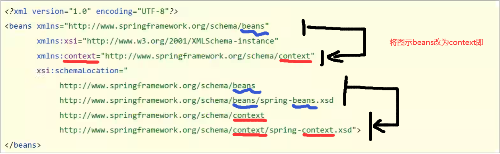
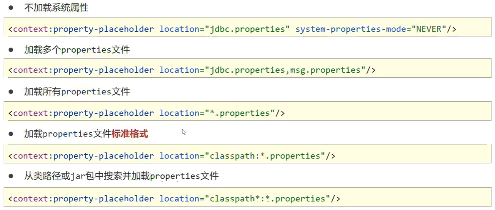

目前对依赖的理解：某个类的依赖就是它运行时必要的参数变量，如下：

```java
public class BookDaoImpl implements BookDao {
    //以下三个都是BookDaoImpl的依赖，其中前两个是简单依赖，后一个是引用依赖（引用其他bean），除此之外还有复杂类型/集合类型
    private int connectionNum;
    private String databaseName;
    private UserDao userDao;
}
```

依赖的注入方式有以下几种：

+ 使用构造函数注入
+ 使用setter方法注入
+ [使用注解注入](./7.注解开发#注解开发依赖注入)（在7.里）

# 单一数据类型的注入

## setter方法注入

### 	引用类型

+ 在bean目标类中定义引用类型属性并提供可访问的set方法

  ```java
  public class BookServiceImpl implements BookService {
      private BookDao bookDao;
  
      public void setBookDao(BookDao bookDao) {
          this.bookDao = bookDao;
      }
  }    
  ```

+ 配置中使用property标签ref属性注入引用类型对象

  ```xml
  <bean 
        id="bookDao" 
        class="com.rainfall.dao.impl.BookDaoImpl"
        />
  
  <bean 
        id="bookService" 
        class="com.rainfall.service.impl.BookServiceImpl"
        >
      <property 
                name="bookDao" 
                ref="bookDao"
                />
  </bean>
  ```

### 	简单类型

+ 在bean目标类中定义简单类型属性并提供可访问的set方法

  ```java
  public class BookDaoImpl implements BookDao {
      private int connectionNum;
      private String databaseName;
  
      public void setConnectionNum(int connectionNum) {
          this.connectionNum = connectionNum;
      }
  
      public void setDatabaseName(String databaseName) {
          this.databaseName = databaseName;
      }
  }    
  ```

+ 配置中使用property标签value属性注入简单类型数据

  ```xml
  <bean 
        id="bookDao" 
        class="com.rainfall.dao.impl.BookDaoImpl" 
        >
          <property 
                    name="databaseName" 
                    value="mysql"
                    />
          <property 
                    name="connectionNum" 
                    value="10"
                    />
  </bean>
  ```

## 构造函数注入

### 	标准注入方式


+ 在bean目标类中定义属性并提供传参构造函数(简单类型与引用类型一样)

  ```java
  public class BookServiceImpl implements BookService {
      
      private BookDao bookDao;
      private int userNum;
      private String userDataBaseName;
  
      public BookServiceImpl(BookDao bookDao,int userNum,String userDataBaseName) {
          this.bookDao = bookDao;
          this.userNum = userNum;
          this.userDataBaseName = userDataBaseName;
      }
  }
  ```

+ 配置中使用constructor-arg标签的ref注入引用类型对象bean，value属性注入简单类型数据

  ```xml
  <bean 
        id="bookService" 
        class="com.rainfall.service.impl.BookServiceImpl"
        >
  <!--        这里的name是构造函数的形参名 -->
  <!--引用类型用ref指向依赖bean名，简单类型用value指定值-->
          <constructor-arg 
                           name="bookDao" 
                           ref="bookDao"
                           />
          <constructor-arg 
                           name="userNum" 
                           value="20"
                           />
          <constructor-arg 
                           name="userDataBaseName" 
                           value="userDataBase"
                           />
  
      
  </bean>
  ```

### 	非标准注入方式

> 由于标准注入方式的constructor-arg标签的name属性值为该bean目标类的构造函数的形参名，造成了xml文件与java耦合性过高，与Spring框架的本意冲突，所以产生了以下解决方法降低其耦合性

+ 方式一：使用type属性取代name属性，type属性是构造函数的形参数据类型（该方法不适用于有多个相同数据类型的bean）

  ```xml
  <bean 
        id="bookService" 
        class="com.rainfall.service.impl.BookServiceImpl"
        >
          <!--        这里的type是构造函数的形参数据类型 -->
          <constructor-arg 
                           type="com.rainfall.dao.BookDao" 
                           ref="bookDao"
                           />
          <constructor-arg 
                           type="int" 
                           value="20"
                           />
          <constructor-arg 
                           type="java.lang.String" 
                           value="userDataBase"
                           />
  </bean>
  ```

+ 方式二：使用index属性取代name属性，index属性是构造函数的形参序号（0开始）

  ```xml
  <bean 
        id="bookService" 
        class="com.rainfall.service.impl.BookServiceImpl"
        >
          <!--        这里的index是构造函数的形参序号 -->
          <constructor-arg 
                           index="0" 
                           ref="bookDao"
                           />
          <constructor-arg 
                           index="1" 
                           value="20"
                           />
          <constructor-arg 
                           index="2" 
                           value="userDataBase"
                           />
  </bean>
  ```

## 自动装配注入

+ 在配置中使用bean标签的autowire属性设置自动装配的类型，共四种

  1. 按类型（常用，byType）
  2. 按名称(byName)
  3. 按构造方法
  4. 不启用自动装配

  ```xml
  <!--首先要注册被依赖对象的bean，不然会空指针异常-->
  <bean 
        name="bookDao" 
        class="com.rainfall.dao.impl.BookDaoImpl"
        />
  <!--在要引用依赖的bean中添加“autowire”属性可执行自动装配，属性内容为装配方式-->
      <bean 
            name="bookService" 
            class="com.rainfall.service.impl.BookServiceImpl" 
            autowire="byType"
            />
  ```

> 注意事项：
>
> 1. 自动装配**用于引用类型依赖注入**，不能对简单类型进行操作（简单类型怎么去注册bean对象？）
>
> 2. 使用按类型装配时(byType)必须保障容器中**相同类型的bean唯一**（**推荐**）
>
> 3. 使用按名称装配时(byName)必须保证容器中**具有指定名称的bean**（**定义的变量名**与配置耦合，不太推荐）
>
> 4. 自动装配优先级低于setter注入与构造器注入，**同时出现时自动装配怕配置失效**

# 集合注入

> 用的不太多，看下也能会，不放解释了只放代码

+ 集合数据类型要有setter方法(其实就是setter注入)

  ```java
  	private int[] array;
      private List<String> list;
      private Set<String> set;
      private Map<String,String> map;
      private Properties properties;
  
      public void setArray(int[] array) {
          this.array = array;
      }
  
      public void setList(List<String> list) {
          this.list = list;
      }
  
      public void setSet(Set<String> set) {
          this.set = set;
      }
  
      public void setMap(Map<String, String> map) {
          this.map = map;
      }
  
      public void setProperties(Properties properties) {
          this.properties = properties;
      }
  ```

+ 在bean中注入(如果集合元素中有引用类型的数据，可以用<ref bean="beanID"/>注入)

  ```xml
  <bean 
        name="bookDao" 
        class="com.rainfall.dao.impl.BookDaoImpl"
        >
      
          <property name="array">
              <array>
                  <value>100</value>
                  <value>200</value>
                  <value>300</value>
              </array>
          </property>
  
          <property name="list">
              <list>
                  <value>rain</value>
                  <value>rainfall</value>
                  <value>rainfall_night</value>
              </list>
          </property>
  
          <property name="set">
              <set>
                  <value>aaaa</value>
                  <value>bbbb</value>
                  <value>bbbb</value>
                  <value>cccc</value>
              </set>
          </property>
  
          <property name="map">
              <map>
                  <entry key="0" value="rain"/>
                  <entry key="1" value="rainfall"/>
                  <entry key="2" value="rainfall_night"/>
              </map>
          </property>
  
          <property name="properties">
              <props>
                  <prop key="001">rain</prop>
                  <prop key="002">rainfall</prop>
                  <prop key="003">rainfall_night</prop>
              </props>
          </property>
      
  </bean>
  ```

# 外部来源管理

## 直接在bean中加载配置

+ 导入外部来源（这里以Druid为例，一个阿里的数据连接池工具,集成了数据库驱动，因此不用额外导入）

  ```xml
  <dependency>
      <groupId>com.alibaba</groupId>
      <artifactId>druid</artifactId>
      <version>1.1.16</version>
  </dependency>
  ```

+ 将其加入bean管理(在此过程要为其注入必要的依赖)

  ```xml
  <bean 
        id="dataSource" 
        class="com.alibaba.druid.pool.DruidDataSource"
        >
          <property 
                    name="driverClassName" 
                    value="com.mysql.jdbc.Driver"
                    />
          <property 
                    name="url" 
                    value="jdbc:mysql://localhost:3306/spring_db"
                    />
          <property 
                    name="username" 
                    value="root"
                    />
          <property 
                    name="password" 
                    value="root"
                    />
      </bean>
  ```

+ 使用。。。

## 使用properties文件加载配置

+ 导入外部来源（没有就不导）

+ 开启context命名空间

  1. 在<beans>中添加

     ```xml
     xmlns:context="http://www.springframework.org/schema/context"
     ```

  2. 在<beans>中的xsi:schemaLocation追加

     ```xml
     http://www.springframework.org/schema/context
                 http://www.springframework.org/schema/context/spring-context.xsd
     ```

  此为更改后的<beans>头

  

+ 使用context命名空间，加载指定properties文件(location即为properties文件)

  ```xml
  <!--非正式写法，仅作演示用-->
  <context:property-placeholder 
           location="jdbc.properties"
           system-properties-mode="NEVER"
                                />
  ```

  1. **如有必要，加入system-properties-mode="NEVER"，否则可能会读取到操作系统的属性值（如键值为username时，操作系统的键值对优先级会大于程序的该键值对）**

  2. 如果要加载多个properties文件，在location中用“,”隔开，下面是加载全部properties文件的写法

     ```xml
     <context:property-placeholder 
              location="*.properties"
              />
     ```

  3. **以下是正式写法，**写程序时务必使用此写法

     1. 写法一：**仅加载程序内部**properties文件（导入的jar包的properties文件不会读取）
     2. 写法二：加载**程序内部**和**导入的jar包**中的properties文件

     ```xml
     <!--写法一-->
     <context:property-placeholder 
              location="classpath:*.properties"
              />
     
     <!--写法二-->
     <context:property-placeholder 
              location="classpath*:*.properties"
              />
     ```

  

+ 使用属性占位符${}为value填入properties文件中对应的属性值（示例）

  ```xml
  <property name="driverClassName" value="${jdbc.driver}"/>
  ```

  
