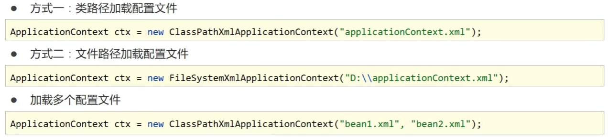
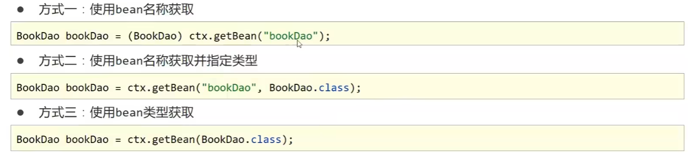
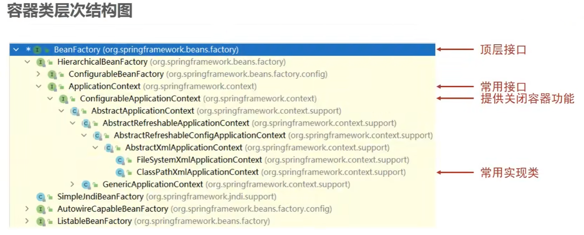
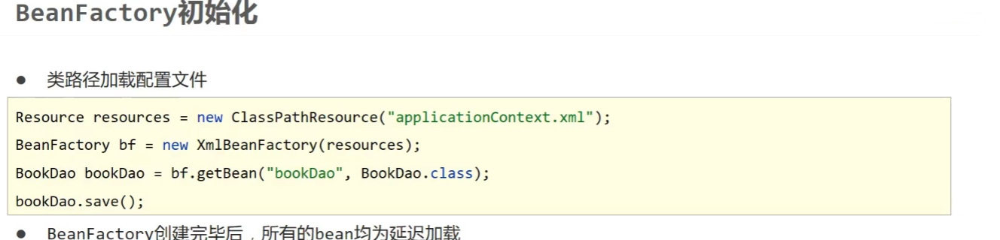

# 创建容器

+ 加载类路径下的配置文件

  ```java
  public static void main(String[] args) {
  	//加载类路径下的配置文件
      ApplicationContext ctx = new ClassPathXmlApplicationContext("applicationContext.xml");
  }
  ```

+ 从文件系统下加载配置文件（测试时报错找不到文件...但一般不使用这个方式）（**报错原因：**当创建容器时使用从文件系统加载，properties的加载就也要使用文件系统加载，否则会找不到properties文件）

  ```java
  public static void main(String[] args) {
  	//加载类路径下的配置文件
      ApplicationContext ctx = new FileSystemXmlApplicationContext("E:\\Projects\\Java\\JavaSSM\\spring_07_di_autoware\\src\\main\\resources\\applicationContext.xml");
  }
  ```

+ 加载多个配置文件

  ```java
  public static void main(String[] args) {
  	//加载多个配置为文件
      ApplicationContext ctx = new ClassPathXmlApplicationContext("applicationContext1.xml","applicationContext2.xml");
  }
  ```



# 获取bean

+ 方式一：使用bean名称获取

  ```java
  BookDao bookDao = (BookDao) ctx.getBean("bookDao");
  ```

+ 方式二：使用bean名称获取并指定类型

  ```java
  BookDao bookDao = ctx.getBean("bookDao",BookDao.class);
  ```

+ 方式三：使用bean类型获取（容器中，此类型的bean只能有一个，不然会报错）

  ```java
  BookDao bookDao = ctx.getBean(BookDao.class);
  ```



# 容器类层次结构



# BeneFactory

