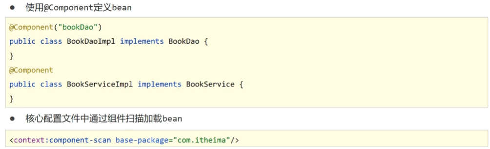
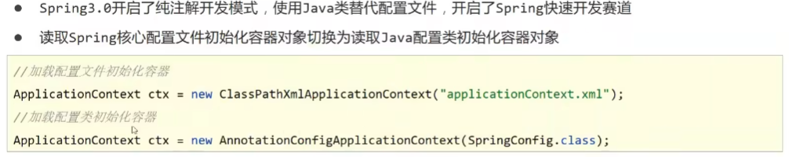
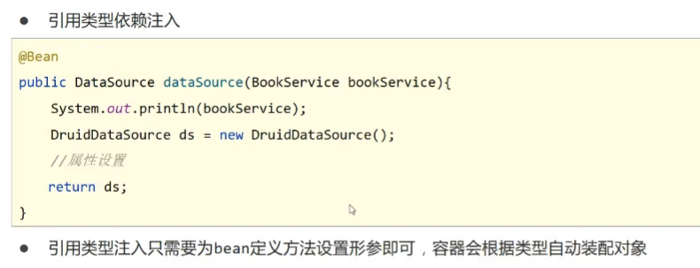
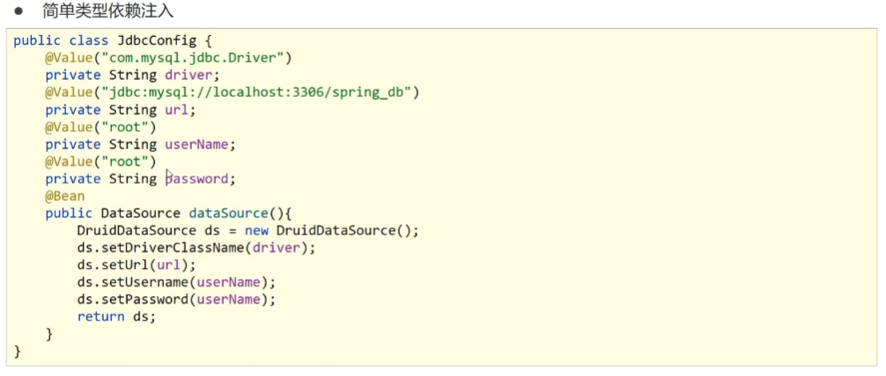

# 注解开发定义bean

+ 使用@Component定义bean,Spring提供@Component注解的三个衍生注解：

  + @Controller：用于表现层bean定义
  + @Service：用于业务层bean定义
  + @Repository:用于数据层bean定义
  
  ```java
  @Component("bookDao")
  public class BookDaoImpl implements BookDao{
      
  }
  @Component("bookDao")
  public class BookServiceImpl implements BookService{
      
  }
  ```
  
+ 在核心配置文件中通过组件扫描加载bean(此行为需要[开启context命名空间](./5.依赖注入#使用properties文件加载配置))

  ```xml
  <context:component-scan base-package="com.rainfall"/>
  ```

  

# 纯注解开发方式

+ Spring 3.0开启了纯注解开放式，使用Java类替代了配置文件

  + 使用**@Configuration**替代了xml文件的头文件

  + 使用**@ComponentScan()**替代了context式的扫描目标（此注解只能添加一次，多个数据路径要用数组格式）

    ```tex
    @ComponentScan({"com.rainfall.service","com.rainfall.dao"})
    ```

    

  ```java
  @Configuration
  @ComponentScan("com.rainfall")
  public class SpringConfig {
  
  }
  ```

+ 初始化容器对象由读取Spring核心配置文件改为**读取Java配置类**

  ```java
  ApplicationContext ctx = new AnnotationConfigApplicationContext(SpringConfig.class);
  ```

  

# 注解开发bean管理

## bean作用范围

+ 使用**@Scope**定义bean作用范围(没接触到JavaWeb是使用前两个就行)

  + `singleton`单例模式(**默认**):全局有且仅有一个实例
  + `prototype`原型模式:每次获取Bean的时候会有一个新的实例
  + `request`: request表示该针对每一次HTTP请求都会产生一个新的bean，同时该bean仅在当前HTTP request内有效
  + `session` :session作用域表示该针对每一次HTTP请求都会产生一个新的bean，同时该bean仅在当前HTTP session内有效
  + `global session` : global session作用域类似于标准的HTTP Session作用域，不过它仅仅在基于portlet的web应用中才有意义

  ```java
  @Repository("bookDao")
  @Scope("singleton")
  public class BookDaoImpl implements BookDao {
      @Override
      public void save() {
          System.out.println("book dao save...");
      }
  }
  ```

  

## bean生命周期

+ 使用**@PostConstructor**、**@PreDestroy**影响bean的生命周期

  + **@PostConstructor**:（含义：在构造函数后）bean生命周期初始化
  + **@PreDestroy**：（含义：在销毁前）bean生命周期销毁函数

  ```java
  @Repository("bookDao")
  @Scope("singleton")
  public class BookDaoImpl implements BookDao {
      @Override
      public void save() {
          System.out.println("book dao save...");
      }
  
      public BookDaoImpl() {
          System.out.println("book dao constructor");
      }
      @PostConstruct
      public void init(){
          System.out.println("book dao init");
      }
      @PreDestroy
      public void destroy(){
          System.out.println("book dao destroy");
      }
  }
  ```

+ 若要将销毁函数完整显示，须如下(将ApplicationContext改为**AnnotationConfigApplicationContext**)

  ```java
  AnnotationConfigApplicationContext ctx = new AnnotationConfigApplicationContext(SpringConfig.class);
          //ctx.registerShutdownHook();
          ctx.close();
  ```

  

# 注解开发依赖注入

> 阉割了不必要（麻烦）的注入方式，保留了**自动注入**

## 引用类型的注入

+ 使用@Autowired注解开启自动装配模式（默认按类型装配）

  + **setter方法可以不写**

  + 如果按类型查找（有同类型的）出现冲突，可以使用**@Qualifier("beanName")**指定按名称装配bean（@Qualifier()必须配合@Autowired使用，**不可单独使用**）

    ```java
    @Autowired
    @Qualifier("bookDao2")
    private BookDao bookDao;
    ```

  ```java
  @Service("bookService")
  public class BookServiceImpl implements BookService {
      @Autowired
      private BookDao bookDao;
  
  //    public void setBookDao(BookDao bookDao) {
  //        this.bookDao = bookDao;
  //    }
  
      @Override
      public void save() {
          System.out.println("book service save...");
          bookDao.save();
      }
  }
  ```

##  简单类型的注入

+ 在要注入的简单类型依赖上添加**@Value()**来注入，()内可以是简单数据类型值，也可以是properties文件键值

  + 使用properties文件时哟啊用**@PropertySource**注解加载到配置类,再使用**@Value()+${}**使用

  + 其路径仅支持单一配置文件，多文件要使用数组格式，**不能使用通配符“*”**

    ```java
    @Configuration
    @ComponentScan("com.rainfall")
    @PropertySource("classpath:jdbc.properties")
    public class SpringConfig {
    }
    ```

    

```java
@Repository("bookDao")
public class BookDaoImpl implements BookDao {
    @Value("rainfall_night")
    private String name;
    @Override
    public void save() {
        System.out.println("book dao save..."+name);
    }

}
```

## 第三方类型注入

+ 将第三方数据导包后，将其依赖封装成一个配置类

  1. 定义一个方法获得要管理的对象
  2. 添加**@Bean**，表示方法返回值是一个bean
  3. 配置其依赖

  ```java
  @PropertySource("classpath:jdbc.properties")
  public class JdbcConfig {
      //1.定义一个方法获得要管理的对象
      //2.添加@Bean，表示方法返回值是一个bean
      @Bean
      public DataSource dataSource(){
          DruidDataSource ds = new DruidDataSource();
          //3.配置其依赖
          ds.setDriverClassName("${jdbc.driver}");
          ds.setUrl("${jdbc.url}");
          ds.setUsername("${jdbc.username}");
          ds.setPassword("${jdbc.password}");
          return ds;
      }
  }
  ```

  > 如果要**为该第三方类注入**资源，可以使用以下形式注入：
  >
  > + 引用类型：使用方法形参**自动装配**
  >
  >   
  >
  > + 简单类型：成员变量
  >
  >   

+ 再在主配置类(SpringConfig)中使用**@Import(ConfigName.class)**将该配置类加载,如果有多个配置类，使用数组类型加载

  ```java
  @Configuration
  @Import(JdbcConfig.class)
  public class SpringConfig {
  
  }
  ```

  

  + 也可以使用**@Configuration**标记该类为配置类，再在主配置类(SpringConfig)中使用**@ComponentScan()**加载该配置类

    ```java
    @Configuration
    @ComponentScan("com.rainfall.config")
    //@PropertySource("classpath:jdbc.properties")
    //@Import(JdbcConfig.class)
    public class SpringConfig {
    
    }
    ```

    ```java
    @Configuration
    @PropertySource("classpath:jdbc.properties")
    public class JdbcConfig {
        //1.定义一个方法获得要管理的对象
        //2.添加@Bean，表示方法返回值是一个bean
        @Bean
        public DataSource dataSource(){
            DruidDataSource ds = new DruidDataSource();
            ds.setDriverClassName("${jdbc.driver}");
            ds.setUrl("${jdbc.url}");
            ds.setUsername("${jdbc.username}");
            ds.setPassword("${jdbc.password}");
            return ds;
        }
    }
    ```

    
