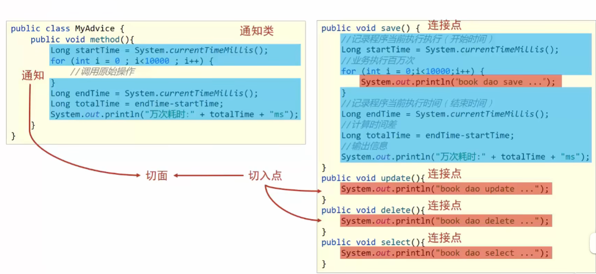
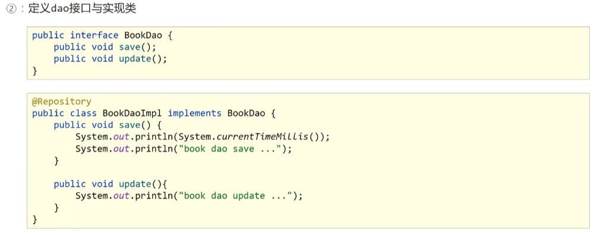

# AOP简介

+ AOP(Aspect Oriented Programming):面向切面编程，一种编程范式，指导开发者如何组织程序结构
  + OOP(Object Oriented Programming)：面向对象编程
+ 作用：在**不惊动原始设计**的基础上为其进行**功能增加**
+ Spring理念：无入侵式/物侵入式

# AOP核心概念



+ 连接点(Joinpoint)：程序执行过程中的任意位置，粒度为执行方法、抛出异常、设置变量等
  + 在SpringAop中，理解为方法的执行
+ 切入点(Pointcut)：匹配连接点的式子
  + 在SpringSAOP中，一个切入点可以只描述一个具体方法，也可以匹配多个方法
    + 一个具体的方法：com.rainfall.dao包下的BookDao接口中的无形参无返回值的save方法
    + 匹配多个方法：所有的sava方法，所有的get开头的方法，所欲哦以Dao结尾的就口中的任意方法，所有带有一个参数的方法
+ 通知(Advice)：在切入点处执行的操作，也就是共性功能
  + 在SpringAOP中，功能最终以方法的形式呈现
+ 通知类：定义通知的类
+ 切面(Aspect)：描述通知与切入点的对应关系

# AOP入门案例（注解实现）

1. 导入AOP相关依赖

   + 说明，Spring-AOP包含在Spring-Context中，不需要重新导入，只要导入aspectjweaver依赖即可

   ```xml
   <!--        Spring框架-->
           <dependency>
               <groupId>org.springframework</groupId>
               <artifactId>spring-context</artifactId>
               <version>5.2.10.RELEASE</version>
           </dependency>
   
   <!--        aspect-->
           <dependency>
               <groupId>org.aspectj</groupId>
               <artifactId>aspectjweaver</artifactId>
               <version>1.9.4</version>
           </dependency>
   ```

2. 定义dao接口和实现类

   

3. 定义切入点

   + **切入点定义依托一个不具有实际意义**（无参，无返回值，方法体无实际逻辑）**的方法进行**

   ```java
   public class MyAdvice {
       @Pointcut("execution(void com.rainfall.dao.BookDao.update())")
       private void pt(){}
   }
   ```

4. 定义通知类,制作通知

   ```java
   public class MyAdvice {
       public void method(){
           System.out.println(System.currentTimeMillis());
       }
   }
   ```

5. 绑定通知与切入点关系,并指定**通知添加到原连接点的具体执行位置**

   ```java
   public class MyAdvice {
       @Pointcut("execution(void com.rainfall.dao.BookDao.update())")
       private void pt(){}
   
       
       @Before("pt()")
       public void method(){
           System.out.println(System.currentTimeMillis());
       }
   }
   ```

6. 将通知类交由Spring容器管理，并将当前类定义为切面类

   + 用@Component将类交由Spring容器管理
   + 用@Aspect将通知类标记为切面

   ```java
   @Component
   @Aspect
   public class MyAdvice {
       //切入点和通知...
   }
   ```

7. 开启Spring对AOP注解的驱动支持

   + 用@EnableAspectJAutoProxy标记项目中有AOP方法

   ```java
   @Configuration
   @ComponentScan("com.rainfall")
   @EnableAspectJAutoProxy
   public class SpringConfig {
   }
   ```

   
