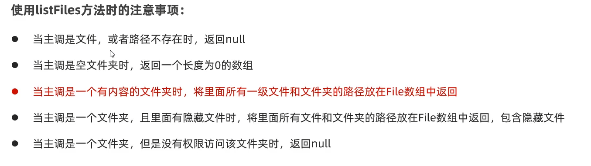
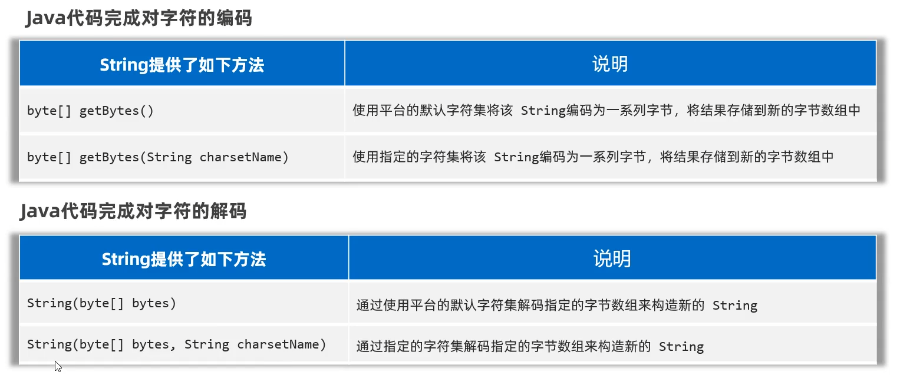

> File类是Java中用于处理电脑文件的类

# File类中常用方法
+ 使用以下方法时要先创建文件对象
```
File f1 = new File("fileName");
```
## 1.判断文件类型、获取文件信息

| 方法名称                            | 说明              |
| :------------------------------ | :-------------- |
| public boolean exits()          | 判断文件对象路径是否存在    |
| public boolean isFile()         | 判断文件对象指代是否为文件   |
| public boolean isDirectory()    | 判断文件对象指代是否为文件夹  |
| public String getName()         | 获取文件对象名称(包含后缀)  |
| public long length()            | 获取文件对象大小，返回字节个数 |
| public long lastModified()      | 获取文件对象最后修改时间    |
| public String getPath()         | 获取创建文件对象时，使用的路径 |
| public String getAbsolutePath() | 获取文件对象绝对路径      |

## 2.创建、删除文件
| 方法名称                           | 说明                       |
| :----------------------------- | :----------------------- |
| public boolean createNewFile() | 创建一个新文件(内容为空)，创建成功返回true |
| public boolean mkdir()         | 创建一个文件夹(只能创建以及文件夹)       |
| public boolean mkdirs()        | 创建多级文件夹                  |
| public boolean delete()        | 删除文件或空文件夹(非空文件夹无法删除)     |

## 3.遍历文件夹
| 方法名称                      | 说明                             |
| :------------------------ | :----------------------------- |
| public String[] list()    | 获取当前目录的所有"一级文件"到一个字符串数组中       |
| public File[] listFiles() | 获取当前目录的所有"一级文件"的文件对象到一个文件对象数组中 |

==注意：==


# 字符的编解码问题


## 1.编码
| String编码                            | 说明                    |
| :---------------------------------- | :-------------------- |
| byte[] getBytes()                   | 使用平台默认字符集将字符串编码为一系列字节 |
| byte[] getBytes(String charsetName) | 使用指定字符集将字符串编码为一系列字节   |

## 2.解码
| String解码                                | 说明                        |
| :-------------------------------------- | :------------------------ |
| String(byte[] bytes)                    | 使用平台默认字符集将指定字节数组编码为为一个字符串 |
| String(byte[] bytes,String charsetName) | 使用指定字符集将指定字节数组编码为为一个字符串   |
