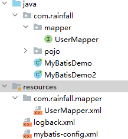

# 在1.MyBatis快速入门方式上使用Mapper代理方式完成数据库操作

> 大致流程：加载MyBatis核心配置文件-->核心配置文件**加载sql映射文件（直接加载/包扫描）**-->sql映射文件与Mapper接口建立代理关系（**sql映射文件namespace指向Mapper代理接口**）-->通过Mapper代理接口方法实现对sql映射文件的调用

+ 定义与SQL映射文件同名的Mapper接口，并将Mapper接口和SQL映射文件放置在同一目录下

  1. 在com.rainfall.mapper包下创建Mapper接口（以UserMapper为例，**与SQL映射文件内同名**）
  2. 在resource文件夹下创建同上路径（com/rainfall/mapper）,将UserMapper.xml移入该文件夹（**编译后xml文件就与接口文件在同一目录下了**）

  

+ 设置SQL映射文件的namespace属性为Mapper接口的全限定名

  ```xml
  <!--namesapce为UserMapper接口的全限定名-->
  <mapper namespace="com.rainfall.mapper.UserMapper">
      <select id="selectAll" resultType="com.rainfall.pojo.User">
          select * from tb_user;
      </select>
  </mapper>
  ```

+ 在Mapper接口中定义方法，**方法名是**SQL映射文件中**sql语句的id**，要保持**参数类型和返回值类型一致**

  ```java
  public interface UserMapper {
      List<User> selectAll();
  }
  ```

+ 编写使用代码(虽然这样代码比直接使用SQL映射文件要多几步，但其耦合性降低，方便后期维护)

  1. 加载MyBatis的核心配置文件，获取SqlSessionFactory

     ```java
     String resource = "mybatis-config.xml";
             InputStream inputStream = Resources.getResourceAsStream(resource);
             SqlSessionFactory sqlSessionFactory = new SqlSessionFactoryBuilder().build(inputStream);
     ```

  2. 获取SqlSession对象，用它来执行sql

     ```java
     SqlSession sqlSession = sqlSessionFactory.openSession();
     ```

  3. 获取UserMapper代理接口对象，并使用接口对象获取对应的sql语句返回值

     ```java
     //获取代理接口对象
     UserMapper userMapper = sqlSession.getMapper(UserMapper.class);
     //代理接口对象方法获取返回值
     List<User> users = userMapper.selectAll();
     ```

  4. 释放资源

     ```java
     sqlSession.close();
     ```

     