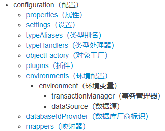

# 核心配置文件结构图
|  |
| :----------------------------------------------------------: |
| Mybatis核心配置文件结构（写入结构时要按照上图顺序，否则会报错） |

# 基础核心配置项解释

官方文档（xml配置）：https://mybatis.org/mybatis-3/zh/configuration.html

+ configuration（全包式结构）：配置项都放在这里面

  + typeAliases（全包结构）：类型别名，可以自定义某个pojo类的别名，在**某些地方就可以不用一层层导包**了

  + environments（全包式结构）：数据库连接信息，其内可配置多个数据库连接，通过defult=(TargetID)确定连接哪一个数据库

    + environment（全包结构）：具体的一个数据库连接，其内配置一个数据库连接，id属性为其全局唯一变量名，可通过id确定使用哪一个数据库连接
      + transactionManager（半包结构）：通过type属性确定事务管理方式
      + dataSource（全包结构）:其内通过<property/>配置数据库连接信息

  + mappers（全包结构）：通过<mapper resource="sql映射文件名"/>或<package name="sql映射文件包名"/>加载sql映射文件

    
