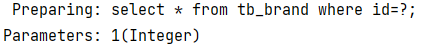
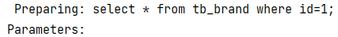
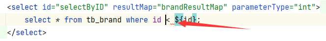
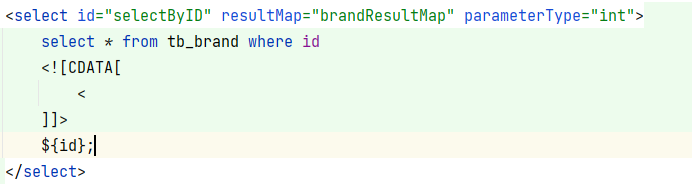
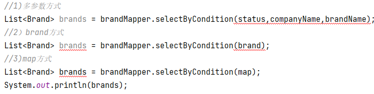
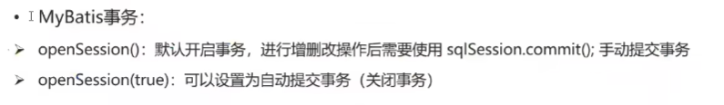

> 此章节主要标记使用配置文件完成增删改查时遇到的问题，配置文件完成增删改查在前文已经提过

#  属性名列名不一致，数据无法自动封装

+ 实体类**属性名** 和 数据库表**列名不一致**，数据无法自动封装：

  1. 起别名：在sql语句中，对不一样的列名取别名，使之与实体类名一样（每个sql查询语句都要定义别名，麻烦）

     ```SQL
     select 
     id,brand_name as brandName,company_name as companyName,order 
     from tb_brand;
     ```

  2. 使用sql标签（代码可复用，但灵活性差）

     ```xml
     <sql id="brand_column">
         id,brand_name as brandName,company_name as companyName,order
     </sql>
     
     <!--使用时的sql语句-->
     
     select 
     <include refid="brand_column"/> 
     from tb_brand;
     ```

  3. 使用resultMap标签（表的列名与实体类属性名一一对应）,id为其全局唯一变量名(找它用的)，type是封装时的数据类型，使用时，在使用的**sql语句内使用resultMap指向id**,**parameterType**指定输入参数类型：

     ```xml
     <!--resultMap标签内将表的列名与实体类属性名一一对应-->
     
     <resultMap id="brandResultMap" type="brand">
     	<result column="brand_name" property="brandName" />
     </resultMap>
     
     <select id="selectAll" resultMap="brandResultMap" parameterType="brand">
     	select * from tb_brand;
     </select>
     ```

# 参数占位符

+ 在使用通过某参数查询时，会用到查询参数，在书写sql语句时使用占位符来代表该参数，并传入参数，参数占位符共有两个，#{} 和 ${}，其内是通过Mapper代理接口方法传入的参数
  + #{}：在使用该占位符时，sql语句占位符位置会被替换为“？”，并在后面传入数据（主要是为了防止SQL注入），**传递参数时务必使用#{}**
  
    
  
  + ${}： 在使用该占位符时，sql语句占位符位置会被直接替换为其内的属性值（会存在SQL注入问题）,**表名或列名不固定时用\${}**(即把它当成拼接字符串用，不能传参)
  
    

# 特殊字符处理

||
|:--:|
|由于sql语句是写在xml文件中，sql语句中的“<”与xml文件标签开始符号冲突，因此，会报错|

解决方法：

+ 使用转义字符-->[转义字符表](./99.转义字符表)

+ CDATA区，使用“CD”快速创建CDATA区，将**冲突符号写入该区**，或**sql语句全部写入该区**：

  

# 多条件查询

> 多条件查询意味着**多条数据输入**，MyBatis提供了三种方法应对多条件查询，以下是对应的sql映射文件sql代码：

```xml
<select id="selectByCondition" resultMap="brandMap">
	select * from tb_brand
    where 
    	status=#{status}
    and company_name like #{companyName}
    and brand_name like #{brandName}
</select>
```

+ 多参数传递一：散装参数接受:如果方法有多个参数，使用@Param("SQL参数占位符名称")

  ```java
  List<Brand> selectByCondition(@Param("status") int status, @Param("companyName") String companyName, @Param("brandName") String brandName);
  ```

+ 参数传递二：对象参数接收：对象的属性名要和参数占位符名一致

  ```java
  List<Brand> selectByCondition(Brand brand);
  ```

+ 参数传递三：Map集合接收，对象的键名要和参数占位符一致

  ```java
  List<Brand> selectByCondition(Map map);
  ```

  

# 动态SQL

> 在JavaWeb运行时，设置的sql语句所需的参数经常不能完全提供，所以使用动态SQL解决这些问题

+ if标签，test属性内写入相应的逻辑判断表达式，sql式的写法

  ```xml
  <select id="selectByCondition" resultMap="brandResultMap">
          select * from tb_brand
          where
          <if test="status != null">
              status=#{status}
          </if>
  </select>
  ```

+ where标签：*where* 元素只会**在子元素返回内容的情况下才插入 “WHERE” 子句**。而且，若子句的开头为 “AND” 或 “OR”，*where* 元素也会**依据情况自动加入或移除**（在所有条件判断不一定会同时出现的情况下使用）

  ```xml
  <select id="selectByCondition" resultMap="brandResultMap">
          select * from tb_brand
  <!--where会判断其内是否有内容才会插入“where”子句，还会根据情况将已有“and”/“or”的子句的“and”/“or”去除-->    
          <where>
              <if test="status != null">
                  and status=#{status}
              </if>
  
              <if test="companyName !=null and companyName != ''">
                  and company_name like #{companyName}
              </if>
              <if test="brandName !=null and brandName != ''">
                  and brand_name like #{brandName}
              </if>
          </where>
  
      </select>
  ```

+ choose、when、otherwise标签：类似于swich、case、default的用法，通常适用于**选择搜索方式后再输入查询值**

  ```XML
  <choose><!--相当于switch-->
              <when test="status != null"><!--相当于case-->
                  status=#{status}
              </when>
              <when test="companyName !=null and companyName != ''">
                  company_name like #{companyName}
              </when>
              <when test="brandName !=null and brandName != ''">
                  brand_name like #{brandName}
              </when>
              <otherwise><!--相当于default-->
                  1=1
              </otherwise>
          </choose>
  ```

+ set标签:可以像where标签一样，自动根据子句是否有返回值调整sql语句

  ```xml
  update tb_brand
          <set>
              <if test="brandName != null and brandName != ''">
                  brand_name = #{brandName},
              </if>
              <if test="companyName !=null and companyName != ''">
                  company_name = #{companyName}
              </if>
              <if test="ordered != null">
                  ordered = #{ordered},
              </if>
              <if test="description != null">
                  description = #{description},
              </if>
              <if test="status != null">
                  status = #{status}
              </if>
          </set>
          where id = #{id}
  ```

+ foreach标签：对输入的集合进行遍历（并在它所在的位置生成一个字符串），在**输入对象未指定时，collection值必须为“array”**，否则会找不到，或在输入对象集合时使用**@Param指定对象名**（mybatis会将数组参数封装为一个Map集合，苏哦一默认情况下，collation=“array”）：

  ```java
  //不使用@Param指定名，collation值就必须为array
  int deleteByIDS(@Param("ids")int[] ids);
  ```

  item为遍历中集合的每一个元素名，separator为各个元素之间的分割符，open会在所有元素前添加一个符号，close则会在所有元素后添加，index可以指定从第几个元素开始

  ```xml
  <!--    根据id批量删除-->
  <delete id="deleteByIDS">
      delete from tb_brand
      where id
      in(
      <foreach collection="ids" item="id" separator=",">
          #{id}
      </foreach>
      );
  </delete>
  ```

  

# 事务提交

> 在执行数据库**增、删、改**的操作时，需要对**事务进行提交**，否则会自动进行事务回滚，导致操作虽然在代码中执行但并没有提交数据库操作

+ 事务提交的整体操作：

  ```java
  //加载mybatis核心配置文件
  InputStream inputStream = Resources.getResourceAsStream("mybatis-config.xml");
          SqlSessionFactory sqlSessionFactory = new SqlSessionFactoryBuilder().build(inputStream);
  
  //2.获取SqlSession对象，用它来执行sql
          SqlSession sqlSession = sqlSessionFactory.openSession();
  
  //3获取UserMapper接口的代理对象
          BrandMapper brandMapper = sqlSession.getMapper(BrandMapper.class);
  
  //执行接口方法
  brandMapper.addInfo(brand);
  
  //提交事务
  sqlSession.commit();
  
  //5.释放资源
  sqlSession.close();
  ```

+ 上述（2.）中，sqlSessionFactory.openSession()表示**默认开启事务**，但进行增删改操作后**要手动提交事务**(sqlSession.commit();),sqlSessionFactory.openSession(true)可以**自动提交事务**：

  

# 主键返回

> 在增删改操作后，一般会需要返回被操作的数据ID，可以使用主键返回操作实现

+ 目前猜测主键返回操作是获取被操作的条目主键，返回输入的对象（因为主键返回的查询是靠**输入的参数对象查询**的）

  ```xml
  <insert id="addInfo"  useGeneratedKeys="true" keyProperty="id">
  	<!--sql语句-->
  </insert>
  ```


# 传参相关

+ 多个参数：可以**使用@Param注解标记参数名称**

  + 默认情况下（不使用@Param），传入的参数会被封装为一个Map集合，每个参数有两个键名（分别为arg[0\~n],param[0\~n]）,因此，在不使用@Param注解时只能使用每个参数的两个键值之一导入参数，因此建议使用@Param注解

+ 单个参数：

  + POJO类型：参数可以直接使用，但须 **属性名 和 参数占位符 名称一致**
  + Map类型：直接使用，但须 **键名 和参数占位符 一致**
  + Collection：传入的集合会被封装为一个Map集合，整个collection集合成为键值，分别被命名为“arg0”和“collection”，所以同多参数时的建议
  + List：也是Map集合，键值是list集合，键名：“arg0”，“collection”，“list”
  + Array：也是Map集合，键值是array集合，键名：“arg0”，“array”(因此，在遍历传入的参数时要么使用@Param定义的名，要么用“array”/“arg0”)
  + 其他类型：因为只有一个参数，与sql语句中参数占位符一一对应，所以可以直接使用
  
  
