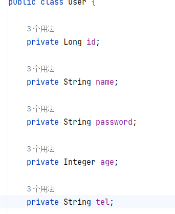

> MyBatisPlus是**基于MyBatis框架**基础上开发的**增强工具**，旨在简化开发、提高效率

# MyBatisPlus入门实例

1. 创建新SpringBoot模块，勾选MySQL Driver

2. 手动添加MyBatisPlus依赖(idea尚未整合MybatisPlus，因此不能直接勾选其依赖)

   ```xml
   <!--        mybatis-plus-->
   <dependency>
   	<groupId>com.baomidou</groupId>
   	<artifactId>mybatis-plus-boot-starter</artifactId>
   	<version>3.4.1</version>
   </dependency>
   ```

3. 再ymal配置文件中设置JDBC参数(如果使用Druid数据源，要导入相应依赖)

   ```yaml
   spring:
     # 数据源配置
     datasource:
       type: com.alibaba.druid.pool.DruidDataSource
       driver-class-name: com.mysql.cj.jdbc.Driver
       url: jdbc:mysql://localhost:3306/mybatis?useSSL=false&userUnicode=true&characterEncoding=UTF-8
       username: root
       password: 2635856148
   ```

4. 创建与表结构相对应的实体类

   

5. 定义数据接口，**继承BaseMapper<User>**

   ```java
   @Mapper
   public interface UserDao extends BaseMapper<User> {
   }
   ```

6. 注入dao接口，使用(以下是一个测试类)

   ```java
   @SpringBootTest
   class Mybatisplus01QuickstartApplicationTests {
   
       @Autowired
       private UserDao userDao;
   
       @Test
       void getAll() {
           List<User> userList = userDao.selectList(null);
   
           System.out.println(userList);
       }
   
   }
   ```

   

