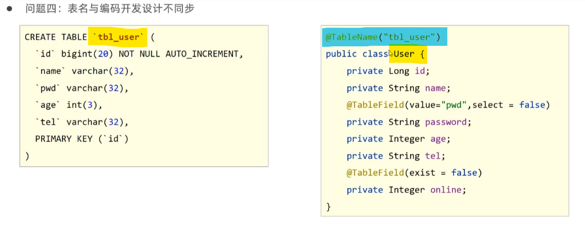
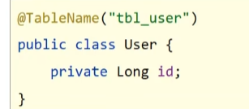

# LomBok依赖

> 一个Java类库，提供一组注解，简化POJO实体类开发

+ 写入依赖,SpringBoot可以自选，写入坐标即可

```xml
<!--lombok依赖,springboot可能自带了，我也母鸡-->
<dependency>
	<groupId>org.projectlombok</groupId>
	<artifactId>lombok</artifactId>
<!--<version>1.18.24</version>-->
	<scope>provided</scope>
</dependency>
```

+ 常用注解：

  + @Data：为当前实体类增添对应的**Getter/Setter方法**、**toString方法**、hashCode方法、**equals方法**

```java
@Data
public class User {
    private Long id;
    private String name;
    private String password;
    private Integer age;
    private String tel;
}
```

# MyBatisPlus数据库功能

## 标准CRUD

|功能|自定义接口|MP接口|
|:--:|:--:|:--:|
| **新增** | **boolean** save(T t) | **int** insert(T t) |
| **删除** | **boolean** delete(**int** id) | **int** deleteById(Serializable id) |
| **修改** | **boolean** update(T t) | **int** updateById(T t) |
| **根据id查询** | T getById(**int** id) | T selectById(Serializable id) |
| **查询全部** | List<T> getAll() | List<T> selectList() |
| **分页查询** | PageInfo<T> getAll(**int** page,**int** size) | IPage<T> selectPage(IPage<T> page) |
| **按条件查询** | List<T> getAll(Condition condition) | IPage<T> selectPage(Wrapper<T> queryWrapper) |

+ 在yml/yaml文件中添加以下配置信息可以开启MyBatisPlus日志功能：

  + 可以输出sql语句

  ```yaml
    #开启mubatisplus的日志（会输出到控制台）
   mybatis-plus:
    configuration:
      log-impl: org.apache.ibatis.logging.stdout.StdOutImpl
  ```

+ 分页查询：

  + 设置拦截器，添加分页拦截器（不加这个分页功能无法实现）
  
  ```java
  public class MyBatisPlusConfig {
      @Bean
      public MybatisPlusInterceptor mybatisPlusInterceptor(){
          //定义MP拦截器
          MybatisPlusInterceptor plusInterceptor = new MybatisPlusInterceptor();
  
          //添加具体的拦截器(分页功能的拦截器)
          plusInterceptor.addInnerInterceptor(new PaginationInnerInterceptor());
  
          return plusInterceptor;
      }
  }
  ```
  
  + 将拦截器类加载到spring配置中
  
  ```java
  @SpringBootApplication
  //也可以使用扫包的方式实现
  //@CompentScan({"com.rainfall.config"})
  @Import({MyBatisPlusConfig.class})
  public class Mybatisplus01QuickstartApplication {
  }
  ```
  
  
  
  + 初始化页数据
  + 给查询方法插入合适数据
  
  ```java
  //分页查询数据
  @Test
  void testGetByPage(){
  	//表示查询第1页，一页有3条(一页3条信息，查询第一页数据)
  	IPage iPage = new Page(1,3);
  	
      //填入页码数据和查询信息
  	userDao.selectPage(iPage,null);
  
  	System.out.println("当前页码值："+iPage.getCurrent());
  	System.out.println("每页显示数："+iPage.getSize());
  	System.out.println("总页数："+iPage.getPages());
  	System.out.println("总条数："+iPage.getTotal());
  	System.out.println("数据："+iPage.getRecords());
  }
  ```

## DQL编程控制

### 条件查询

> （多条件查询以下方法直接添加wrapper的条目，or选择直接在某条目后+”**.or()**“）

+ **普通方式按条件查询：**
  1. 实例化QueryWrapper()，用实例对象添加查询条件

```java
//方式一：按条件查询
QueryWrapper wrapper = new QueryWrapper();

//查询条件：age 小于（&lt;）18
wrapper.lt("age",18);

List<User> userList = userDao.selectList(wrapper);

System.out.println(userList);
```

+ **lambda格式按条件查询：**
  1. 实例化QueryWrapper()，并为其添加泛型，用实例对象添加查询条件

```java
//方式二：lambda格式按条件查询(要添加泛型)
QueryWrapper<User> wrapper = new QueryWrapper();

wrapper.lambda().lt(User::getAge,18);

List<User> userList = userDao.selectList(wrapper);
System.out.println(userList);
```

+ **lambda格式按条件查询二：**
  1. 实例化LambdaQueryWrapper()，并为其添加泛型，用实例对象添加查询条件

```java
//方式三：lambda格式按条件查询
LambdaQueryWrapper<User> wrapper = new LambdaQueryWrapper<>();

wrapper.lt(User::getAge,19);

List<User> userList = userDao.selectList(wrapper);
System.out.println(userList);
```
+ **条件查询——null值处理**

  1. 为实体类添加上下限设置，（此处通过另一个实体类继承原实体类实现，原实体类数据为下限，新实体类数据为上限）
  2. 在为查询添加条件时为其添加一个boolean类型的环境，当**环境判断通过时才会将该条件最终添加到sql中**

  ```java
  //对空值的处理
  //以下为模拟数据
  UserQuery userQuery = new UserQuery();
  //下限数据为空
  //userQuery.setAge(10);
  userQuery.setAge2(30);
  
  
  LambdaQueryWrapper<User> lambdaQueryWrapper = new LambdaQueryWrapper<>();
  //
  lambdaQueryWrapper.lt(userQuery.getAge2() != null,User::getAge, userQuery.getAge2());
  lambdaQueryWrapper.gt(userQuery.getAge() != null, User::getAge, userQuery.getAge());
  
  List<User> userList = userDao.selectList(lambdaQueryWrapper);
  System.out.println(userList);
  ```

### 查询投影(查询投影)

> 查询投影就是设置查询出来的数据长什么样

1. 方式一：不使用Lambda表达式

   + 此方式可以使用**”as“**为列命名

   ```java
   QueryWrapper<User> queryWrapper = new QueryWrapper<>();
   queryWrapper.select("id as '身份号'","name", "tel");
   //使用selectMaps()方法，数据会封装成一个Map类型的List数据
   List<Map<String, Object>> userList = userDao.selectMaps(queryWrapper);
   System.out.println(userList);
   ```

   

2. 方式二：使用Lambda表达式

   + 此方式在选择列时会**有代码提示，不会写错**

   ```java
   LambdaQueryWrapper<User> lambdaQueryWrapper = new LambdaQueryWrapper<>();
   lambdaQueryWrapper.select(User::getId,User::getName,User::getTel);
   List<Map<String, Object>> userList = userDao.selectMaps(lambdaQueryWrapper);
   System.out.println(userList);
   ```

### 查询条件

> 所有条件查询方式见  [条件构造器](https://baomidou.com/pages/10c804/#abstractwrapper)

### 字段映射与表名映射

#### 字段映射

1. 表字段与实体类属性设计不同步(**同属性，不同名**)

   + 在数据库设计与实体类的对应中，可能会出现实体类参数名与数据库表字段名不匹配的情况。在**MyBatis中**可以在**xml文件中使用resultMap将其对应**，在**Mapper代理类**中可以直接**使用字段=参数的方式**对应

   + 在MyBatisPlus中可以在要与数据库字段匹配的实体类参数上**使用@TableField(value=“数据库字段名”)**将实体类参数与数据库字段名对应起来

   

2. 编码中添加了数据库中未定义的属性(**实体类中多了数据库字段中没有的属性**)

   

   + 在实体类设计中可能会出现在数据库字段未出现的属性，在向数据库插入或修改数据时，多余的属性可能会导致数据库操作失败。因此可以**使用@TableField(exist=false)标记属性不在数据库字段的范围内**

   

3. 采用了默认查询方式开放了更多的字段查看权限(**一些不该直接展示的字段被展示了**)

   


   + 在数据展示或传递时，一些属性如密码等不应该直接被展示，所以**使用@TableField(select=false)使得该属性不参与查询**

   
+ 使用到的注解：
   + 名称：**@TableField()**

   + 类型：**属性注解**

   + 位置：实体类属性定义上方

   + 作用：设置当前属性对应的数据库表中的字段关系

   + 实例：

     

   + 相关属性

     + value(默认)：**设置数据库表字段名**
     + exist：**设置属性在数据库字段中是否存在**，默认为false。此属性**无法与value合并使用**
     + select：**设置属性是否参与查询，此属性与select()映射配置不冲突**

#### 表名映射



+ 使用到的注解：

  + 名称：**@TableName()**

  + 类型：**类注解**

  + 位置：实体类上方

  + 作用：设置当前类对应的数据库表关系

  + 实例：

    

  + 相关属性

    + value(默认)：**设置数据库表名**

### id生成策略

+ 使用**@TableId(type = )**标记实体类中的id属性（与数据库主键对于应的属性）或在yml配置文件中**使用mybatis-plus.global-config.db-config.id-type:** 标记主键，可以**实现对新插入数据库数据id的控制**，其中type值可以为：
  + **IdType.AUTO**：**数据库ID自增**，依照数据库设置的自增原则，由数据库决定条目的id属性（使用时要**确保数据库设置了id自增**）
  + **IdType.NONE**：**未设置主键生成策略**(基本时跟随全局的，而全局约等于INPUT)
  + **IdType.INPUT**：**用户输入ID**，如果在新建数据时没有填充ID，会报错(可以**通过id填充插件自动填充**)
  + **IdType.ASSIGN_ID**：（主键为number或String类型）**默认通过雪花算法为插入的新数据填充id**
  + **IdType.ASSIGN_UUID**：同上，但主键为String类型才行

### 逻辑删除

> **逻辑删除并不是真正的删除表数据**，而是将被删除的数据打上特殊标记，使其达到与正常数据区别开来的效果（实际上就是另加一个字段，被逻辑删除的数据就修改该字段的值到被删除状态）

+ 在数据表中添加‘deleted’字段，在实体类中添加‘deleted’属性，用以判定字段是否被逻辑删除

+ 在实体类属性上添加**@TableLogic()**或在yml配置文件中使用**mybatis-plus.global-config.db-config.logic-delete-field:**标记逻辑删除修改字段

  1. 方法一：使用**value=“”,delval=“”**标记是否被删除的状态，value是未被删除时的字段值，delval是被删除时的字段值
  2. 方法二：使用**logic-not-delete-value，logic-delete-value**标记未删除/删除时的字段值

  + 逻辑删除实际上的sql语句：

  

###　乐观锁

> 　乐观锁假设数据一般情况下不会造成冲突，所以在数据进行提交更新的时候，才会正式对数据的冲突与否进行检测

1. 数据库表中添加锁标记字段

   

2. 实体类中添加对应字段，并设定当前字段未乐观锁标记字段

   ```java
   @Data
   @TableName("tbl_user")
   public class User {
   
       @TableId(type = IdType.AUTO)
       private Long id;
   
       private String name;
   
       @TableField(value = "pwd",select = false)
       private String password;
   
       private Integer age;
   
       private String tel;
   
       @TableField(exist = false)
       private Integer onLine;
   
       @TableLogic(value = "0",delval = "1")
       private Integer deleted;
   
       @Version
       private Integer version;
   }
   ```

3. 配置乐观锁拦截器，实现锁机制对应的动态SQL语句拼装

   ```java
   //设置为配置类扫包或在主类中使用@Import添加配置类
   //@Configuation
   public class MyBatisPlusConfig {
   
       @Bean
       public MybatisPlusInterceptor mybatisPlusInterceptor(){
           //定义MP拦截器
           MybatisPlusInterceptor plusInterceptor = new MybatisPlusInterceptor();
   
           //添加具体的拦截器
           //分页功能的拦截器
           plusInterceptor.addInnerInterceptor(new PaginationInnerInterceptor());
           //乐观锁拦截器
           plusInterceptor.addInnerInterceptor(new OptimisticLockerInnerInterceptor());
   
           return plusInterceptor;
       }
   }
   ```

4. 使用乐观锁机制**修改表数据之前**要**获取到对应数据条目的version才可正常进行**

   ```java
   @Test
   void testUpdate(){
       //获取到对应的条目
       User user = userDao.selectById(2L);
       //设置模拟修改的参数
       user.setName("Jerry686");
       user.setAge(56);
   
       //执行乐观锁修改
       userDao.updateById(user);
   }
   ```

   
