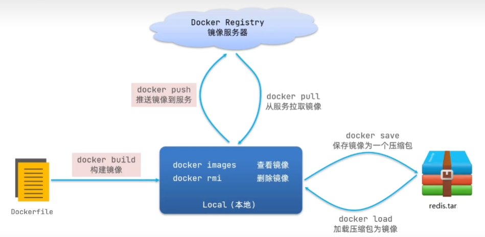
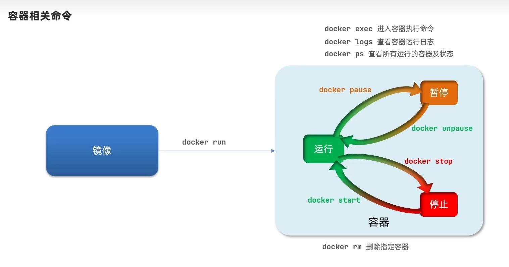
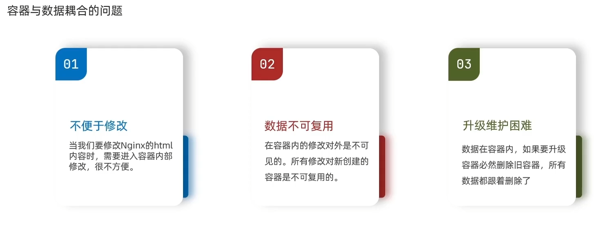
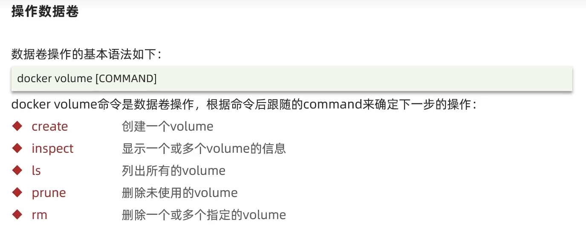
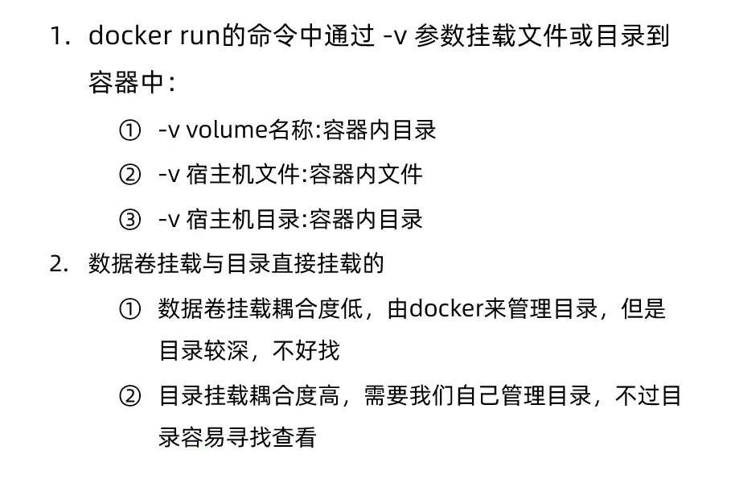

[DockerHub](https://hub.docker.com/)
# 镜像操作
> 镜像名称分为两部分组成：`[repository]:[tag]`（`[镜像名]:[镜像版本]`）
> 在没有指定tag时，默认是latest，代表最新版本的镜像

**镜像操作命令：**

# 容器操作
**容器操作命令：**

# 数据卷操作
==容器使用中会存在容器与数据耦合的问题，==使用数据卷可以减小耦合度

==数据卷操作语法：==

==容器数据挂载方式：==使用`docker run -v [dir/volumeName]:[container-dir]`方式挂载目录或文件到容器中,可以选择宿主机**目录/文件直接挂载到容器**或**数据卷方式挂载到容器**

